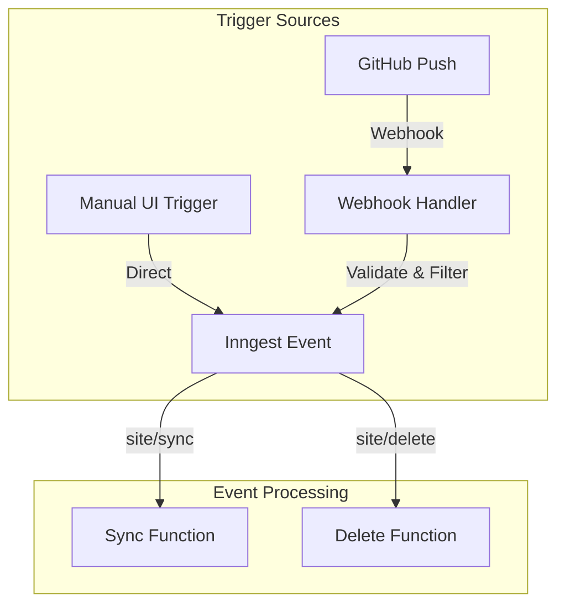
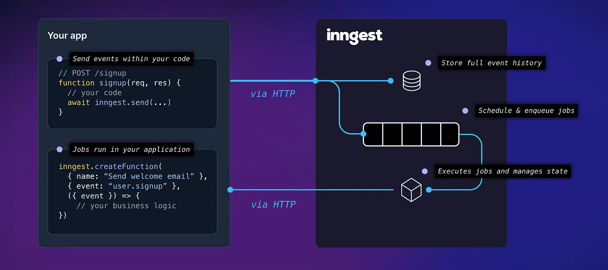

# DataHub Cloud

DataHub Cloud is a NextJS multitenant application designed for seamlessly publishing markdown content from GitHub repositories.

## Project Overview

The application provides:

- Multi-tenant architecture supporting multiple users and sites
- Built-in authentication via GitHub
- Markdown content publishing from GitHub repositories
- Custom domain support
- Automatic content synchronization

## Architecture

The application is built with:

- **Frontend**: Next.js with TypeScript
- **Database**: PostgreSQL (Neon, managed by Vercel) for user accounts and site metadata
- **Storage**: R2 Cloudflare buckets for content storage
- **Authentication**: NextAuth with GitHub OAuth
- **Deployment**: Vercel
- **Background Jobs**: Inngest

## Site Creation and Data Flow

The site creation process follows these steps:

1. **GitHub Authentication**

- Users authenticate with GitHub OAuth
- Application requests necessary repository access permissions
- User can manage app access through GitHub settings

2. **Site Configuration**

- User selects:
  - GitHub account
  - Repository to publish from
  - Branch to track (defaults to 'main')
  - Root directory (optional, for publishing specific folder)
- User creates a new site with the selected configurations

3. **Site Content Processing**

- Initial site synchronization triggered
  - Content filtered by supported file types (.md, .json, .yaml)
  - Markdown files processed for:
    - YAML frontmatter
    - Associated datapackage metadata
    - Computed fields (URL, title, description)
  - Files uploaded to R2 Cloudflare buckets
  - Metadata stored in PostgreSQL

4. **Consecutive Site Content Synchronization**

- Automatic sync triggered with GitHub webhooks (default)
- Manual sync option available

## Content Synchronization Architecture

### Inngest Configuration

The synchronization process is managed by Inngest, with configuration files located in:

- `/inngest/client.ts` - Event definitions and client setup
- `/inngest/functions.ts` - Sync and delete functions implementation



### Sync Process Details



1. **Event Handling and Routes**

- Webhook Handler (`/app/api/webhook/route.ts`):

  - Receives GitHub push events
  - Validates webhook signatures
  - Filters events by branch
  - Triggers Inngest sync events

- Inngest Handler (`/app/api/inngest/route.ts`):

  - Serves Inngest webhook endpoints
  - Registers sync and delete functions
  - Handles function execution and retries

- Function Configuration (`/inngest/functions.ts`):
  - Concurrency limit: 10 per account
  - Cancellation on: new sync or delete events
  - Error handling with specific error types:
    - BLOB_SYNC_ERROR
    - INVALID_ROOT_DIR
    - INTERNAL_ERROR

2. **Sync Trigger Points**

   - Automatic (via GitHub webhooks):
     - Push events to tracked branch
     - Validated using webhook secret
     - Branch-specific filtering
   - Manual (via UI):
     - User-initiated sync
     - Force sync option available
   - Initial sync:
     - On site creation
     - Full repository processing

3. **Detailed Sync Steps**
   When a site sync is triggered (either automatically or manually), the following steps occur in sequence:

   a. **Initial Setup**

   - Fetch site details and user information from PostgreSQL
   - Update site's sync status to "PENDING"
   - Load site configuration from repository's config.json
   - Parse content include/exclude patterns from config
   - Validate root directory exists (if specified)

   b. **Tree Comparison**

   - Fetch current content tree from R2 storage
   - Fetch repository tree from GitHub API
   - Compare SHA hashes to detect changes
   - If trees match (no changes):
     - Update sync status to "SUCCESS"
     - Exit sync process early

   c. **File Processing**
   For each changed file:

   - Filter by supported extensions (.md, .json, .yaml)
   - Apply content include/exclude patterns
   - Download file content from GitHub
   - Upload raw file to R2 storage
   - For markdown files:
     - Parse YAML frontmatter for metadata
     - Look for associated datapackage file
     - If README.md/index.md, check directory for datapackage
     - Compute metadata (URL, title, description)
     - Store metadata in PostgreSQL
   - For datapackage files:
     - Find associated README.md/index.md
     - Parse package metadata
     - Update linked markdown file metadata
     - Store combined metadata in PostgreSQL

   d. **Deletion Handling**

   - Compare old and new trees to find deleted files
   - Remove deleted files from R2 storage
   - Clean up associated metadata from PostgreSQL
   - For deleted datapackage files:
     - Recompute metadata for associated markdown files
     - Update database records accordingly

   e. **Final Steps**

   - Upload new tree structure to R2
   - Update site metadata in PostgreSQL
   - Update sync status to "SUCCESS"
   - Clear any previous sync errors
   - Update sync timestamp
   - Revalidate Next.js cache tags for:
     - Site metadata
     - Site permalinks
     - Site tree
     - Page content

4. **Content Storage**

   - Files stored in R2 Cloudflare buckets
   - Tree structure maintained for efficient diffing
   - Metadata stored in PostgreSQL for quick access

5. **Error Handling**
   - Detailed error messages stored in database
   - Non-retriable errors marked permanent:
     - Invalid root directory
     - YAML frontmatter parsing errors
     - Invalid datapackage format
   - Retriable errors with automatic retry:
     - GitHub API rate limits
     - Network timeouts
     - Storage upload failures
   - Error status visible in site dashboard
   - Detailed error logs in Inngest dashboard

### Monitoring and Debugging

The sync process can be monitored through the Inngest Dashboard:

[Inngest Dashboard](https://app.inngest.com) (you need an invite to the organization)

Key metrics available:

- Success/failure rates
- Processing times
- Error distribution
- Event queues

### Local Development

For local development, run the Inngest dev server:

```bash
npx inngest-cli@latest dev --no-discovery -u http://localhost:3000/api/inngest
```

Monitor local events at: http://localhost:8288/

## Environment Setup

### Local Development Setup

1. Clone the [repository](https://github.com/datopian/datahub-next)
2. Create a `.env` file from `.env.example`
3. Set up local PostgreSQL database
4. Configure database variables in `.env`
5. Set up MinIO for local storage:

   ```bash
   # Install MinIO on MacOS
   brew install minio/stable/minio

   # Start MinIO server
   minio server ~/minio
   ```

6. Configure MinIO bucket:

   - Open MinIO Console at http://localhost:9000
   - Login with default credentials (minioadmin/minioadmin)
   - Click "Buckets" → "Create Bucket"
   - Create bucket named "datahub"
   - Set bucket Access Policy to "public"

7. Run `pnpm fetch-config` or create your own `config.json` file
8. Install pnpm: `npm install -g pnpm`
9. Install dependencies: `pnpm i`
10. Generate Prisma schema: `npx prisma generate`
11. Create database schema: `npx prisma db push`
12. Start development server: `pnpm dev`
13. Start local Inngest instance:
    ```bash
    npx inngest-cli@latest dev --no-discovery -u http://localhost:3000/api/inngest
    ```
14. Visit app at `http://cloud.localhost:3000`

#### Stripe Setup for Local Development

1. Install the [Stripe CLI](https://stripe.com/docs/stripe-cli#install):

   ```bash
   brew install stripe-cli
   ```

2. Log in to your Stripe account:

   ```bash
   stripe login
   ```

3. Start the Stripe webhook listener:

   ```bash
   stripe listen --forward-to localhost:3000/api/stripe/webhook
   ```

4. Copy the webhook signing secret that Stripe CLI outputs and update your `.env`:

   ```
   STRIPE_WEBHOOK_SECRET=whsec_.... # Use the secret from stripe listen command
   ```

5. Keep the Stripe CLI running in a separate terminal while testing subscriptions

The webhook listener will now forward Stripe events to your local server, enabling:

- Subscription creation and management
- Premium plan activation
- Subscription updates and cancellations

## Environment Configuration

### Environment Variables

- Create `.env` file based on `.env.example`
- All environment variables must be defined in `env.mjs`
- Access variables using `import { env } from './env.mjs'`

### App Configuration

The application is configurable via `config.json` file (path set via `APP_CONFIG_URL`). Configuration options include:

- Title
- Description
- Favicon URL
- Logo URL
- Thumbnail URL
- Navigation links
- Social links
- Site aliases

Current config file: [DataHub Cloud config.json](https://dash.cloudflare.com/83025b28472d6aa2bf5ae59f3724aa78/r2/default/buckets/datahub-assets/objects/config.json/details)

## Infrastructure

### Databases

PostgreSQL databases on Vercel:

- Production: `datahub-cloud`
- Staging: `datahub-cloud-staging`
- Development: Local PostgreSQL instance

### Content Storage

R2 Cloudflare buckets:

- Production: `datahub-cloud`
- Staging: `datahub-cloud-staging`
- Development: Local MinIO instance

### Authentication

GitHub OAuth applications under Datopian account:

- Production: `DataHub Cloud`
- Staging: `DataHub Cloud - Staging`
- Development: `DataHub Cloud - Dev`

### Domain Configuration

#### Root Domain (datahub.io)

Two projects share the datahub.io domain:

1. DataHub Cloud app (`@username/projectname` paths)
2. DataHub.io website (landing pages)

Traffic routing managed by Cloudflare worker:

- Landing pages (`/`, `/publish`, `/pricing`, `/collections`) → datahub-io project
- All other paths → datahub-next-new project

Worker: [datahub-io-reverse-proxy](https://dash.cloudflare.com/83025b28472d6aa2bf5ae59f3724aa78/workers/services/view/datahub-io-reverse-proxy)

#### Subdomains

- Production: `cloud.datahub.io`
- Staging: `staging-cloud.datahub.io`

## Development

### Branching Strategy

Two main branches:

- `main` (production)
  - Protected branch
  - No direct pushes
  - Changes merged via staging
- `staging`
  - Testing environment
  - Accepts pull requests

### Development Workflow

1. Create feature branch from `staging`
2. Implement changes
3. Submit PR to `staging`
4. After approval, changes are merged to `main`

### Commit Strategy

We use a squash-based system:

1. Developers work freely on feature branches
2. PRs are squash-merged to `staging`
3. Commit messages follow conventional commits specification
4. Changes are rebased from staging to main

## Testing

### Prerequisites

Access to https://github.com/datopian/datahub-cloud-test-repo

### Running Tests

Start the application:

```bash
pnpm dev
```

Run tests:

```bash
# Run all non-authenticated tests
npx playwright test

# Run authenticated dashboard tests
npx playwright test dashboard.spec.ts

# Run specific test file
npx playwright test path/to/test.spec.ts

# Run specific test by name
npx playwright test --grep "should show subscription options on free tier"
```

Note: If you need to reprocess a test site even when its repository content hasn't changed (e.g., when the app's processing logic has changed), you can uncomment the `forceSync` option in `e2e/global.setup.ts`.

Debug modes:

```bash
# Debug mode
npx playwright test --debug

# UI mode
npx playwright test --ui
```

**Important:** Always run E2E tests locally before submitting PRs, especially tests that require authentication (like `dashboard.spec.ts`). This ensures that authenticated features are properly tested since these tests are automatically skipped in CI environment.

### Authenticated Tests

Some tests (like dashboard.spec.ts) require authentication. These tests:

1. Are automatically skipped in CI environment
2. Require manual login by default:

   - When running dashboard tests, a browser window will open
   - You'll need to manually log in with your GitHub account
   - The test will continue automatically after successful login
   - Your authentication state will be saved for subsequent test runs

3. For non-2FA accounts only: You can optionally automate login by setting GitHub credentials in `.env`:
   ```
   E2E_GH_USERNAME=your-github-username
   E2E_GH_PASSWORD=your-github-password
   ```
   Note: This only works for accounts without 2FA enabled. For accounts with 2FA, use manual login.

## Content Management

### Special Pages

DataHub Cloud manages several aliased pages:

#### Core Datasets

- Path: `/core/xxx`
- Alias for: `/@olayway/xxx`
- Source: https://github.com/datasets
- Auto-sync enabled

#### Blog

- Path: `/blog`
- Alias for: `@olayway/blog`
- Source: https://github.com/datahubio/blog
- Auto-sync enabled

#### Collections

- Path: `/collections/*`
- Alias for: `@olayway/collections/*`
- Source: https://github.com/datasets/awesome-data
- Auto-sync enabled

#### Documentation

- Path: `/docs`
- Alias for: `@olayway/docs`
- Source: https://github.com/datahubio/datahub-cloud-template
- Auto-sync enabled

#### Notes

- Path: `/notes`
- Alias for: `@rufuspollock/data-notes`
- Auto-sync enabled

#### Logistics

- Path: `/logistics/postal-codes-*`
- Alias for: `@olayway/postal-codes-*`
- Source: https://github.com/datopian/postal-codes
- Manual sync required via admin page

### Site Aliases

- Configured via `siteAliases` in `config.json`
- Used to provide clean URLs for official content
- Enables consistent branding across different content sources

## Troubleshooting

### Common Issues

1. MinIO Connection Issues

   - Verify MinIO is running
   - Check credentials in `.env`
   - Ensure bucket is publicly accessible

2. Database Connection

   - Verify PostgreSQL is running
   - Check database credentials
   - Ensure schema is up to date

3. OAuth Authentication

   - Verify correct OAuth app configuration
   - Check callback URLs
   - Ensure environment variables are set

4. Stripe Integration
   - Ensure Stripe CLI is running with webhook forwarding
   - Verify STRIPE_WEBHOOK_SECRET matches Stripe CLI output
   - Check Stripe CLI logs for webhook delivery status
   - Confirm subscription events in Stripe Dashboard
   - Verify database updates after subscription events

For additional support, please create an issue in the GitHub repository.
