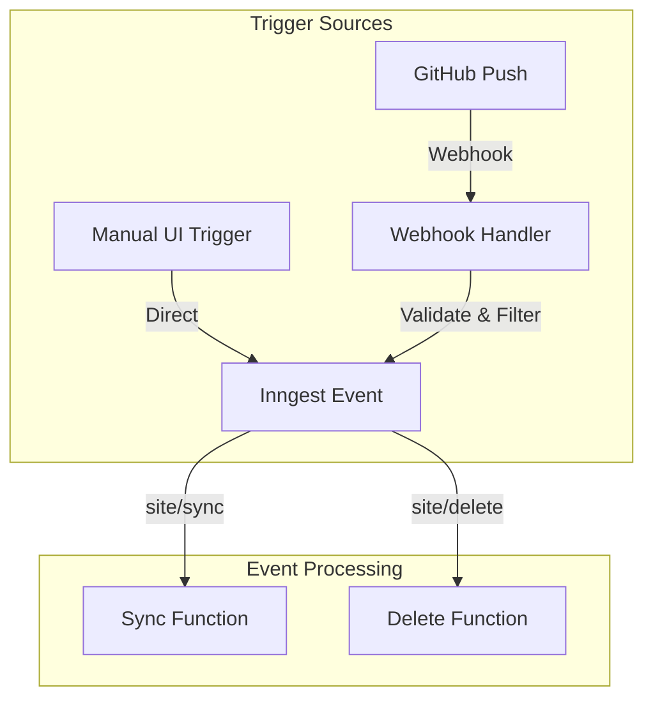

# Flowershow Web App

> Flowershow Cloud — the fast and simple way to turn markdown into a website

This is the main Next.js application for [flowershow.app](https://flowershow.app/).

For documentation and how-to guides, visit [https://flowershow.app/docs](https://flowershow.app/docs).

REST API reference (OpenAPI 3.1): `packages/api-contract`

## Project Overview

Flowershow Cloud is a NextJS multitenant application designed for seamlessly publishing markdown content from GitHub repositories.

The application provides:

- Multi-tenant architecture supporting multiple users and sites
- Built-in authentication via GitHub
- Markdown content publishing from GitHub repositories
- Automatic content synchronization

## Architecture

The application is built with:

- **Frontend**: Next.js with TypeScript
- **Database**: PostgreSQL (Neon, managed by Vercel) for user accounts and site metadata
- **Storage**: R2 Cloudflare buckets for content storage
- **Authentication**: NextAuth with GitHub OAuth
- **Deployment**: Vercel
- **Background Jobs**: Inngest + Cloudflare worker
- **Content indexing**: Typesense
- **Subscriptions**: Stripe

## Site Creation and Data Flow

The site creation process follows these steps:

1. **GitHub Authentication**

- Users authenticate with GitHub OAuth
- Application requests necessary repository access permissions

2. **Site Configuration**

- User selects:
  - Repository to publish from
  - Branch to track (defaults to 'main')
  - Root directory (optional, for publishing specific folder)
- User creates a new site with the selected configurations

3. **Site Content Processing**

- Initial site synchronization triggered
  - Inngest sync function fetches files from GitHub, creates Blob records in the database and uploads the files to R2 storage
  - Each markdown file uploaded to R2 triggers the Cloudflare worker, which processes it and updates associated Blob records in the db with the extracted data (e.g. frontmatter fields)

4. **Consecutive Site Content Synchronization**

- Automatic sync triggered with GitHub webhooks (default)
- Manual sync option available

## Content Synchronization Architecture

### Inngest Configuration

The synchronization process is managed by Inngest, with configuration files located in:

- `inngest/client.ts` - Event definitions and client setup
- `inngest/functions.ts` - Sync and delete functions implementation



### Sync Process Details


1. **Event Handling and Routes**

- Webhook Handler (`app/api/webhook/route.ts`):
  - Receives GitHub push events
  - Validates webhook signatures
  - Filters events by branch
  - Triggers Inngest sync events

- Inngest Handler (`app/api/inngest/route.ts`):
  - Serves Inngest webhook endpoints
  - Registers sync and delete functions
  - Handles function execution and retries

- Function Configuration (`inngest/functions.ts`):
  - Concurrency limit: 10 per account
  - Cancellation on: new sync or delete events
  - Error handling with specific error types:
    - BLOB_SYNC_ERROR
    - INVALID_ROOT_DIR
    - INTERNAL_ERROR

2. **Sync Trigger Points**
   - Automatic (via GitHub webhooks):
     - Push events to tracked branch
     - Validated using webhook secret
     - Branch-specific filtering
   - Manual (via UI):
     - User-initiated sync
     - Force sync option available
   - Initial sync:
     - On site creation
     - Full repository processing

3. **Detailed Sync Steps**
   When a site sync is triggered (either automatically or manually), the following steps occur in sequence:

   a. **Initial Setup**
   - Fetch site details and user information from PostgreSQL
   - Update site's sync status to "PENDING"
   - Load site configuration from repository's config.json
   - Parse content include/exclude patterns from config
   - Validate root directory exists (if specified)

   b. **Tree Comparison**
   - Fetch current content tree from R2 storage
   - Fetch repository tree from GitHub API
   - Compare SHA hashes to detect changes
   - If trees match (no changes):
     - Update sync status to "SUCCESS"
     - Exit sync process early

   c. **File Processing**
   For each changed file:
   - Filter by supported extensions (.md, .json, .yaml)
   - Apply content include/exclude patterns
   - Download file content from GitHub
   - Upload raw file to R2 storage
   - For markdown files:
     - Parse YAML frontmatter for metadata
     - Look for associated datapackage file
     - If README.md/index.md, check directory for datapackage
     - Compute metadata (URL, title, description)
     - Store metadata in PostgreSQL
   - For datapackage files:
     - Find associated README.md/index.md
     - Parse package metadata
     - Update linked markdown file metadata
     - Store combined metadata in PostgreSQL

   d. **Deletion Handling**
   - Compare old and new trees to find deleted files
   - Remove deleted files from R2 storage
   - Clean up associated metadata from PostgreSQL
   - For deleted datapackage files:
     - Recompute metadata for associated markdown files
     - Update database records accordingly

   e. **Final Steps**
   - Upload new tree structure to R2
   - Update site metadata in PostgreSQL
   - Update sync status to "SUCCESS"
   - Clear any previous sync errors
   - Update sync timestamp
   - Revalidate Next.js cache tags for:
     - Site metadata
     - Site permalinks
     - Site tree
     - Page content

4. **Content Storage**
   - Files stored in R2 Cloudflare buckets
   - Tree structure maintained for efficient diffing
   - Metadata stored in PostgreSQL for quick access

5. **Error Handling**
   - Detailed error messages stored in database
   - Non-retriable errors marked permanent:
     - Invalid root directory
     - YAML frontmatter parsing errors
     - Invalid datapackage format
   - Retriable errors with automatic retry:
     - GitHub API rate limits
     - Network timeouts
     - Storage upload failures
   - Error status visible in site dashboard
   - Detailed error logs in Inngest dashboard

### Monitoring and Debugging

The sync process can be monitored through the Inngest Dashboard:

[Inngest Dashboard](https://app.inngest.com) (you need an invite to the organization)

Key metrics available:

- Success/failure rates
- Processing times
- Error distribution
- Event queues

### Local Development

The Inngest dev server starts automatically as part of `pnpm dev:up`.

Monitor local events at: http://localhost:8288/

## Environment Setup

### Local Development Setup

**Prerequisites:** Docker and pnpm installed.

1. Install dependencies from the monorepo root:
   ```bash
   pnpm install
   ```

2. Create a `.env` file from `.env.example`:
   ```bash
   cp apps/flowershow/.env.example apps/flowershow/.env
   ```

3. Fetch or create the app config:
   ```bash
   pnpm --filter @flowershow/app fetch-config
   ```
   Or create your own `apps/flowershow/config.json` file.

4. Start everything:
   ```bash
   pnpm dev:up
   ```

   This single command:
    - Starts **PostgreSQL** (localhost:5433), **MinIO** (localhost:9000), and **Inngest** (localhost:8288) via Docker
   - Auto-creates the MinIO `flowershow` bucket with public access
   - Configures MinIO webhook notifications to the Cloudflare Worker
   - Runs Prisma migrations
   - Starts the Next.js app (localhost:3000) and Cloudflare Worker (localhost:8787)

5. Visit the app at `http://cloud.localhost:3000`

#### Optional services

Add flags to include extra services:

```bash
pnpm dev:up --stripe           # + Stripe webhook forwarding
pnpm dev:up --github           # + Smee GitHub webhook proxy
pnpm dev:up --search           # + Typesense search engine
pnpm dev:up --stripe --github  # combine any flags
pnpm dev:up:all                # everything
```

**Stripe** requires `STRIPE_SECRET_KEY` in your `.env` (Stripe test key). You must also `stripe login` once on the host before first use.

**Smee** requires `GH_WEBHOOK_URL` in your `.env` (your Smee channel URL).

**Typesense** runs on localhost:8108 with API key `xyz`.

#### Stopping services

```bash
pnpm dev:down   # stop containers, keep data volumes
pnpm dev:nuke   # stop containers + delete all data (fresh start)
```

#### Service endpoints

| Service    | URL                    | Credentials            |
|------------|------------------------|------------------------|
| Next.js    | http://localhost:3000   |                        |
| Worker     | http://localhost:8787   |                        |
| PostgreSQL | localhost:5433         | postgres / postgres    |
| MinIO API  | http://localhost:9000   | minioadmin / minioadmin |
| MinIO Console | http://localhost:9001 | minioadmin / minioadmin |
| Inngest    | http://localhost:8288   |                        |
| Typesense  | http://localhost:8108   | API key: `xyz`         |

## Environment Configuration

### Environment Variables

- Create `.env` file based on `.env.example`
- All environment variables must be defined in `env.mjs`
- Access variables using `import { env } from './env.mjs'`

### App Configuration

The application is configurable via `config.json` file (path set via `APP_CONFIG_URL`). Configuration options include:

- Title
- Description
- Favicon URL
- Logo URL
- Thumbnail URL
- Navigation links
- Social links
- Site aliases

Current config file: [DataHub Cloud config.json](https://dash.cloudflare.com/83025b28472d6aa2bf5ae59f3724aa78/r2/default/buckets/datahub-assets/objects/config.json/details)

## Infrastructure

### Databases

PostgreSQL databases on Vercel:

- Production: `datahub-cloud`
- Staging: `datahub-cloud-staging`
- Development: Local PostgreSQL instance

### Content Storage

R2 Cloudflare buckets:

- Production: `datahub-cloud`
- Staging: `datahub-cloud-staging`
- Development: Local MinIO instance

### Authentication

GitHub OAuth applications under Datopian account:

- Production: `DataHub Cloud`
- Staging: `DataHub Cloud - Staging`
- Development: `DataHub Cloud - Dev`

### Domain Configuration

#### Root Domain (datahub.io)

Two projects share the datahub.io domain:

1. DataHub Cloud app (`@username/projectname` paths)
2. DataHub.io website (landing pages)

Traffic routing managed by Cloudflare worker:

- Landing pages (`/`, `/publish`, `/pricing`, `/collections`) → datahub-io project
- All other paths → datahub-next-new project

Worker: [datahub-io-reverse-proxy](https://dash.cloudflare.com/83025b28472d6aa2bf5ae59f3724aa78/workers/services/view/datahub-io-reverse-proxy)

#### Subdomains

- Production: `cloud.datahub.io`
- Staging: `staging-cloud.datahub.io`

## Development

### Branching Strategy

Two main branches:

- `main` (production)
  - Protected branch
  - No direct pushes
  - Changes merged via staging
- `staging`
  - Testing environment
  - Accepts pull requests

### Development Workflow

1. Create feature branch from `staging`
2. Implement changes
3. Submit PR to `staging`
4. After approval, changes are merged to `main`

### Commit Strategy

We use a squash-based system:

1. Developers work freely on feature branches
2. PRs are squash-merged to `staging`
3. Commit messages follow conventional commits specification
4. Changes are rebased from staging to main

## Testing

### Prerequisites

Access to https://github.com/flowershow/test

### Running Tests

#### Unit Tests

From the monorepo root:

```bash
pnpm test
```

Or from `apps/flowershow/`:

```bash
pnpm test
```

#### E2E Tests

All E2E commands below should be run from `apps/flowershow/`.

1. Authenticate user

Log in manually and save authentication cookies to a JSON file:

```bash
npx playwright codegen 'http://cloud.localhost:3000/api/auth/signin/github?callbackUrl=http://cloud.localhost:3000' \
  --save-storage=playwright/.auth/user.json
```

Note: after you log in to the dashboard, you can close the Playwright browser window.

2. Start the application

Start all services (core + Stripe + worker):

```bash
pnpm dev:up --stripe
```

Or if you need GitHub webhooks too:

```bash
pnpm dev:up --stripe --github
```

Run the tests:

```bash
# Run all tests
npx playwright test

# Run specific project
npx playwright test --project=free-site-chromium

# Run specific test file
npx playwright test path/to/test.spec.ts

# Run specific test by name
npx playwright test --grep "should show subscription options on free tier"

# Skip global setup and run tests against last created site(s)
npx playwright test --no-deps
# npx playwright test --project=free-site-chromium --no-deps
```

Note: All tests will first execute `global.setup.ts` file, which creates a test site. To save time, you can run the global setup once, and then skip it when running tests:

```bash
# E.g. for free-site project. Add --no-deps to ignore global teardown
npx playwright test free-site/global.setup.ts --no-deps
# Then run your tests always with --no-deps flag, e.g.
npx playwright test path/to/test.spec.ts --no-deps
```

Debug modes:

```bash
# Debug mode
npx playwright test --debug

# UI mode
npx playwright test --ui
```

## Troubleshooting

### Common Issues

1. **Docker containers won't start**
   - Check if ports are already in use: `lsof -i :5433 -i :9000 -i :8288`
   - Try a clean restart: `pnpm dev:nuke && pnpm dev:up`
   - Check container logs: `docker compose logs <service>`

2. MinIO Connection Issues
   - Verify MinIO is running: `docker compose ps minio`
   - Check credentials in `.env` match docker-compose defaults (minioadmin/minioadmin)
   - Check bucket exists: visit http://localhost:9001

3. Database Connection
   - Verify PostgreSQL is running: `docker compose ps postgres`
   - Check database credentials in `.env`
   - Reset database: `pnpm dev:nuke && pnpm dev:up`

4. OAuth Authentication
   - Verify correct OAuth app configuration
   - Check callback URLs
   - Ensure environment variables are set

5. Stripe Integration
   - Ensure you started with `pnpm dev:up --stripe`
   - Verify `STRIPE_SECRET_KEY` is set in `.env`
   - Check Stripe CLI logs: `docker compose logs stripe-cli`
   - You must run `stripe login` once on the host before first use

6. Typesense Search
   - Ensure you started with `pnpm dev:up --search`
   - Check Typesense health status: `curl http://localhost:8108/health`
   - Verify environment variables in `.env`

For additional support, please create an issue in the GitHub repository.
