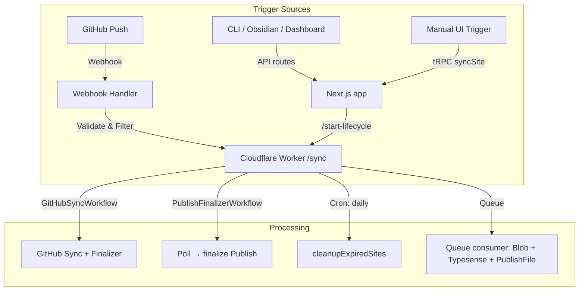

# Flowershow Web App

> Flowershow Cloud — the fast and simple way to turn markdown into a website

This is the main Next.js application for [flowershow.app](https://flowershow.app/).

For documentation and how-to guides, visit [https://flowershow.app/docs](https://flowershow.app/docs).

REST API reference (OpenAPI 3.1): `packages/api-contract`

## Project Overview

Flowershow Cloud is a NextJS multitenant application that lets users publish markdown content from GitHub repositories or via direct file uploads (CLI, Obsidian plugin, dashboard).

The application provides:

- Multi-tenant architecture supporting multiple users and sites
- Built-in authentication via GitHub
- Markdown content publishing from GitHub repositories and direct uploads
- Automatic content synchronization via Cloudflare Workflows

## Architecture

The application is built with:

- **Frontend**: Next.js with TypeScript
- **Database**: PostgreSQL (Neon, managed by Vercel) for user accounts and site metadata
- **Storage**: R2 Cloudflare buckets for content storage
- **Authentication**: NextAuth with GitHub OAuth
- **Deployment**: Vercel
- **Background Jobs**: Cloudflare Workflows + Cloudflare Worker (Queues)
- **Content indexing**: Typesense
- **Subscriptions**: Stripe

## Publish Pipeline

Every publish goes through the same lifecycle regardless of how it was triggered.

### Actors

**`GitHubSyncWorkflow`** (`apps/cloudflare-worker`) — GitHub path only. Creates the `Publish` record, diffs the GitHub tree against stored Blobs, creates all `PublishFile` records, starts `PublishFinalizerWorkflow`, then uploads files to R2.

**`PublishFinalizerWorkflow`** (`apps/cloudflare-worker`) — all paths, `instanceId = publishId`. Polls every 10 seconds until all `PublishFile` rows for the publish reach a terminal state, then sets `Publish.status` (`success` / `error` / `superseded`) and revalidates Next.js cache tags.

**Queue consumer** (`apps/cloudflare-worker`) — all paths. Processes one file per message: upserts the Blob record, updates Typesense, flips the `PublishFile` row to `success` or `error`. Blob deletion is driven by R2 `DeleteObject` events handled by the same consumer. No coordination logic — the consumer does not signal the finalizer.

### Step order (every publish)

1. Create `Publish` record.
2. Create `PublishFile` rows (`uploading`) for files to upsert.
3. Delete files from R2; create terminal `PublishFile` rows (`success`/`error`) for each deletion.
4. Start `PublishFinalizerWorkflow`.
5. Upload files to R2 (GitHub path) or return presigned URLs to client (presigned paths).

### Per-path implementation

**GitHub path** — Worker `/sync` endpoint handles supersession and starts `GitHubSyncWorkflow`, which owns steps 1–5.

**Presigned paths (CLI, Obsidian, dashboard)** — Next.js API routes (`/sync`, `/files`) own steps 1–4 directly, then return presigned R2 PUT URLs to the client.

### Sync trigger points


```mermaid
graph TD
    subgraph "Trigger Sources"
        GH[GitHub Push] -->|Webhook| WH[Webhook Handler]
        CLI[CLI / Obsidian / Dashboard] -->|API routes| NX[Next.js app]
        UI[Manual UI Trigger] -->|tRPC syncSite| NX
        WH -->|Validate & Filter| CW[Cloudflare Worker /sync]
        NX -->|/start-lifecycle| CW
    end

    subgraph "Processing"
        CW -->|GitHubSyncWorkflow| SF[GitHub Sync + Finalizer]
        CW -->|PublishFinalizerWorkflow| PF[Poll → finalize Publish]
        CW -->|Cron: daily| DF[cleanupExpiredSites]
        CW -->|Queue| QC[Queue consumer: Blob + Typesense + PublishFile]
    end
```

### Supersession

When a new publish starts, any in-flight `PublishFile` rows from previous publishes for the same paths are canceled (`status = 'canceled'`). The finalizer for those publishes naturally exits when it polls and finds no `uploading` rows remaining, setting `Publish.status = 'superseded'`.

Full-site syncs (`/sync` for both GitHub and presigned paths) also explicitly terminate the previous `PublishFinalizerWorkflow` instance. Concurrent `/files` (subset) publishes leave previous finalizers running — they poll independently and exit when their rows are done.

## Site Creation and Data Flow

1. **GitHub Authentication** — Users authenticate with GitHub OAuth.

2. **Site Configuration** — User selects repository, branch (defaults to `main`), and optional root directory.

3. **Initial Sync** — Triggered on site creation. `GitHubSyncWorkflow` fetches files from GitHub, creates `Publish` + `PublishFile` records, and uploads files to R2. R2 events drive the queue consumer, which creates/updates `Blob` records and indexes content in Typesense. `PublishFinalizerWorkflow` sets the final `Publish.status`.

4. **Consecutive Syncs** — Automatic (GitHub webhooks) or manual (UI). Same pipeline as above, with path-scoped supersession of any in-progress publish.

## Local Development

**Prerequisites:** Docker and pnpm installed.

1. Install dependencies from the monorepo root:
   ```bash
   pnpm install
   ```

2. Create a `.env` file from `.env.example`:
   ```bash
   cp apps/flowershow/.env.example apps/flowershow/.env
   ```

3. Fetch or create the app config:
   ```bash
   pnpm --filter @flowershow/app fetch-config
   ```
   Or create your own `apps/flowershow/config.json` file.

4. Start everything:
   ```bash
   pnpm dev:up
   ```

   This single command:
   - Starts **PostgreSQL** (localhost:5432) and **MinIO** (localhost:9000) via Docker
   - Auto-creates the MinIO `flowershow` bucket with public access
   - Configures MinIO webhook notifications to the Cloudflare Worker
   - Runs Prisma migrations
   - Starts the Next.js app (localhost:3000) and Cloudflare Worker (localhost:8787)

5. Visit the app at `http://cloud.localhost:3000`

### Optional services

Add flags to include extra services:

```bash
pnpm dev:up --stripe           # + Stripe webhook forwarding
pnpm dev:up --github           # + Smee GitHub webhook proxy
pnpm dev:up --search           # + Typesense search engine
pnpm dev:up --stripe --github  # combine any flags
pnpm dev:up:all                # everything
```

**Stripe** requires `STRIPE_SECRET_KEY` in your `.env` (Stripe test key). You must also `stripe login` once on the host before first use.

**Smee** requires `GH_WEBHOOK_URL` in your `.env` (your Smee channel URL).

**Typesense** runs on localhost:8108 with API key `xyz`.

### Stopping services

```bash
pnpm dev:down   # stop containers, keep data volumes
pnpm dev:nuke   # stop containers + delete all data (fresh start)
```

### Service endpoints

| Service       | URL                      | Credentials              |
|---------------|--------------------------|--------------------------|
| Next.js       | http://localhost:3000     |                          |
| Worker        | http://localhost:8787     |                          |
| PostgreSQL    | localhost:5432            | postgres / postgres      |
| MinIO API     | http://localhost:9000     | minioadmin / minioadmin  |
| MinIO Console | http://localhost:9001     | minioadmin / minioadmin  |
| Typesense     | http://localhost:8108     | API key: `xyz`           |

## Environment Configuration

### Environment Variables

- Create `.env` file based on `.env.example`
- All environment variables must be defined in `env.mjs`
- Access variables using `import { env } from './env.mjs'`

### App Configuration

The application is configurable via `config.json` file (path set via `APP_CONFIG_URL`). Configuration options include:

- Title
- Description
- Favicon URL
- Logo URL
- Thumbnail URL
- Navigation links
- Social links
- Site aliases

## Infrastructure

### Databases

PostgreSQL databases on Vercel (Neon):

- Production: `flowershow`
- Staging: `flowershow-staging`
- Development: Local PostgreSQL instance

### Content Storage

R2 Cloudflare buckets:

- Production: `flowershow`
- Staging: `flowershow-staging`
- Development: Local MinIO instance

### Authentication

GitHub OAuth applications:

- Production: `Flowershow`
- Staging: `Flowershow - Staging`
- Development: `Flowershow - Dev`

### Monitoring and Debugging

The publish pipeline can be monitored through:
- Cloudflare Workers dashboard → queue event logs
- Cloudflare Workflows dashboard → `GitHubSyncWorkflow` and `PublishFinalizerWorkflow` instances

## Development

### Branching Strategy

Two main branches:

- `main` (production)
  - Protected branch
  - No direct pushes
  - Changes merged via staging
- `staging`
  - Testing environment
  - Accepts pull requests

### Development Workflow

1. Create feature branch from `staging`
2. Implement changes
3. Submit PR to `staging`
4. After approval, changes are merged to `main`

### Commit Strategy

We use a squash-based system:

1. Developers work freely on feature branches
2. PRs are squash-merged to `staging`
3. Commit messages follow conventional commits specification
4. Changes are rebased from staging to main

## Testing

### Prerequisites

Access to https://github.com/flowershow/test

### Running Tests

#### Unit Tests

From the monorepo root:

```bash
pnpm test
```

Or from `apps/flowershow/`:

```bash
pnpm test
```

#### E2E Tests

All E2E commands below should be run from `apps/flowershow/`.

1. Authenticate user

Log in manually and save authentication cookies to a JSON file:

```bash
npx playwright codegen 'http://cloud.localhost:3000/api/auth/signin/github?callbackUrl=http://cloud.localhost:3000' \
  --save-storage=playwright/.auth/user.json
```

Note: after you log in to the dashboard, you can close the Playwright browser window.

2. Start the application

Start all services (core + Stripe + worker):

```bash
pnpm dev:up --stripe
```

Or if you need GitHub webhooks too:

```bash
pnpm dev:up --stripe --github
```

Run the tests:

```bash
# Run all tests
npx playwright test

# Run specific project
npx playwright test --project=free-site-chromium

# Run specific test file
npx playwright test path/to/test.spec.ts

# Run specific test by name
npx playwright test --grep "should show subscription options on free tier"

# Skip global setup and run tests against last created site(s)
npx playwright test --no-deps
# npx playwright test --project=free-site-chromium --no-deps
```

Note: All tests will first execute `global.setup.ts` file, which creates a test site. To save time, you can run the global setup once, and then skip it when running tests:

```bash
# E.g. for free-site project. Add --no-deps to ignore global teardown
npx playwright test free-site/global.setup.ts --no-deps
# Then run your tests always with --no-deps flag, e.g.
npx playwright test path/to/test.spec.ts --no-deps
```

Debug modes:

```bash
# Debug mode
npx playwright test --debug

# UI mode
npx playwright test --ui
```

## Troubleshooting

### Common Issues

1. **Docker containers won't start**
   - Check if ports are already in use: `lsof -i :5432 -i :9000`
   - Try a clean restart: `pnpm dev:nuke && pnpm dev:up`
   - Check container logs: `docker compose logs <service>`

2. **MinIO connection issues**
   - Verify MinIO is running: `docker compose ps minio`
   - Check credentials in `.env` match docker-compose defaults (minioadmin/minioadmin)
   - Check bucket exists: visit http://localhost:9001

3. **Database connection**
   - Verify PostgreSQL is running: `docker compose ps postgres`
   - Check database credentials in `.env`
   - Reset database: `pnpm dev:nuke && pnpm dev:up`

4. **OAuth authentication**
   - Verify correct OAuth app configuration
   - Check callback URLs
   - Ensure environment variables are set

5. **Stripe integration**
   - Ensure you started with `pnpm dev:up --stripe`
   - Verify `STRIPE_SECRET_KEY` is set in `.env`
   - Check Stripe CLI logs: `docker compose logs stripe-cli`
   - You must run `stripe login` once on the host before first use

6. **Typesense search**
   - Ensure you started with `pnpm dev:up --search`
   - Check Typesense health status: `curl http://localhost:8108/health`
   - Verify environment variables in `.env`

For additional support, please create an issue in the GitHub repository.
