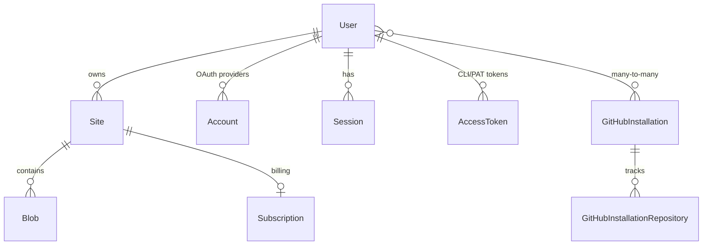

# Flowershow Platform Architecture

Flowershow is a multitenant platform that turns markdown into published websites. Users can publish content via three channels: connecting a GitHub repository, using the CLI (`@flowershow/publish`), or publishing directly from Obsidian via the Flowershow plugin.

The platform consists of four codebases:

| Component | Location | Stack |
|-----------|----------|-------|
| **Web App** | This repo | Next.js 15, Prisma, tRPC, Inngest |
| **CLI** | `flowershow/cli` | TypeScript, Commander.js |
| **Cloudflare Worker** | `flowershow/cloudflare-worker` | Cloudflare Workers, Queues |
| **Obsidian Plugin** | `flowershow/obsidian-flowershow` | TypeScript, React, MUI |

## System Overview

```
┌──────────────┐  ┌──────────────┐  ┌──────────────────┐
│  Obsidian    │  │   CLI        │  │  GitHub App      │
│  Plugin      │  │  `publish`   │  │  Webhook         │
└──────┬───────┘  └──────┬───────┘  └────────┬─────────┘
       │ PAT token       │ CLI token          │ installation
       │                 │                    │
       ▼                 ▼                    ▼
┌─────────────────────────────────────────────────────────┐
│                  Next.js App (Vercel)                    │
│                                                         │
│  /api/sites/id/{id}/files  ◄── Plugin & CLI uploads     │
│  /api/sites/id/{id}/sync   ◄── CLI sync (diff + upload) │
│  /api/webhooks/github-app  ◄── GitHub push events       │
│  /api/sites/publish-anon   ◄── Anonymous publish        │
│                                                         │
│  Presigned R2 URLs returned to client for direct upload │
└───────────┬──────────────────────┬──────────────────────┘
            │                      │
            │ Inngest (GitHub)     │ Presigned PUT
            ▼                      ▼
┌────────────────┐       ┌────────────────────┐
│   Inngest      │       │  Cloudflare R2     │
│   Background   │──────►│  (file storage)    │
│   Jobs         │upload └────────┬───────────┘
└────────────────┘                │ R2 event notification
                                  ▼
                        ┌────────────────────┐
                        │  Cloudflare Worker  │
                        │  (queue consumer)   │
                        │  - parse frontmatter│
                        │  - extract metadata │
                        │  - image dimensions │
                        │  - Typesense index  │
                        └─────────┬──────────┘
                                  │
                    ┌─────────────┼─────────────┐
                    ▼             ▼              ▼
              ┌──────────┐ ┌──────────┐  ┌───────────┐
              │ Postgres │ │ Typesense│  │ R2 delete │
              │ (Blob    │ │ (search  │  │ (publish: │
              │  update) │ │  index)  │  │  false)   │
              └──────────┘ └──────────┘  └───────────┘
```

## Multi-Domain Routing

The app serves multiple domains, resolved in `middleware.ts`:

| Domain | Purpose | Rewrites to |
|--------|---------|-------------|
| `NEXT_PUBLIC_HOME_DOMAIN` (flowershow.app) | Landing page, marketing | `/home/*` |
| `NEXT_PUBLIC_CLOUD_DOMAIN` (cloud.flowershow.app) | Dashboard, auth, API | `/dashboard/*` (requires auth) |
| `NEXT_PUBLIC_ROOT_DOMAIN` (my.flowershow.app) | Published user sites | `/site/[user]/[project]/*` |
| Custom domains | User's own domains | Resolved via `app/api/domain/` |

The middleware also handles:
- CORS for the Obsidian plugin (`app://obsidian.md` origin).
- PostHog reverse proxy at `/relay-qYYb/`.
- Password-protected site access via JWT cookies.
- Raw file serving with extension whitelist.

## Data Model

Defined in `prisma/schema.prisma`. Key entities:



### Key Fields

**User**: id, username, ghUsername, email, role (USER | ADMIN), feedback (JSONB).

**Site**: ghRepository, ghBranch, rootDir, projectName, subdomain, customDomain, autoSync, plan (FREE | PREMIUM), privacyMode (PUBLIC | PASSWORD), syntaxMode (md | mdx | auto), isTemporary, anonymousOwnerId, installationId.

**Blob**: path, appPath, permalink, sha, metadata (JSONB), extension, syncStatus (UPLOADING | PROCESSING | SUCCESS | ERROR), width, height.

**AccessToken**: name, tokenHash (SHA-256), prefix (`fs_cli_` or `fs_pat_`), type (CLI | PAT), expiresAt (null = never), lastUsedAt.

**DeviceCode**: deviceCode, userCode (`XXXX-XXXX` format), authorized (boolean), expiresAt. Used for the CLI OAuth device flow.

**GitHubInstallation**: installationId, accountLogin, accountType. Tracks GitHub App installations with many-to-many relationship to Users.

## Publishing Flows

There are four ways content reaches the platform. All ultimately result in files stored in R2 and Blob records in Postgres.

### Flow 1: GitHub Repository (auto-sync)

This is the primary flow for users who connect a GitHub repo to their site.

1. User installs the Flowershow GitHub App on their repo.
2. On push, GitHub sends a webhook to `POST /api/webhooks/github-app`.
3. The webhook handler validates the payload, looks up the site by installationId + repo, and sends an Inngest `site/sync` event.
4. The Inngest sync function (`inngest/functions.ts`):
   - Fetches the GitHub tree via API (uses installationId for auth).
   - Compares tree SHA against the stored tree to detect changes.
   - Diffs remote files against existing Blob records.
   - Downloads changed files from GitHub in batches (batch size 20).
   - Uploads each file to R2 at key `{siteId}/main/raw/{path}`.
   - Creates/updates Blob records in Postgres.
   - Deletes removed files from R2 and Postgres.
   - Updates the Typesense search index.
5. Each R2 upload triggers a Cloudflare Queue message, consumed by the worker (see "Cloudflare Worker" below).

**Legacy flow**: An older OAuth-based webhook at `POST /api/webhook` also exists for sites not yet migrated to the GitHub App. Same Inngest sync, but uses user OAuth tokens instead of installation tokens.

### Flow 2: CLI (`@flowershow/publish`)

The CLI is an npm package (`publish` binary). Repo: `../cli/`.

**Auth**: Uses OAuth 2.0 Device Authorization Grant (RFC 8628):
1. CLI calls `POST /api/cli/device/authorize` → gets `device_code` + `user_code`.
2. User visits `cloud.flowershow.app/cli/verify`, enters code, authorizes.
3. CLI polls `POST /api/cli/device/token` until authorized → receives `fs_cli_*` token.
4. Token stored at `~/.flowershow/token.json`.

**Initial publish** (`publish <path>`):
1. CLI discovers files (respects `.gitignore`), calculates SHA-1 hashes.
2. Calls `POST /api/sites` to create the site.
3. Calls `POST /api/sites/id/{siteId}/sync` with file manifest `[{ path, size, sha }]`.
4. Server creates Blob records, generates presigned R2 upload URLs (1-hour TTL), returns `{ toUpload, toUpdate, unchanged, deleted }`.
5. CLI uploads each file directly to R2 via presigned PUT URLs.
6. CLI polls `GET /api/sites/id/{siteId}/status` until all blobs reach SUCCESS status.

**Incremental sync** (`publish sync <path>`):
- Same flow but the server diffs SHA hashes to determine which files are new, changed, unchanged, or deleted. Only new/changed files get upload URLs. Deletions are handled server-side.
- Supports `--dry-run` to preview changes without applying them.

**Limits**: Max 100MB per file, 500MB per request, 1000 files per request.

**Commands**: `publish auth login|logout|status`, `publish <path>`, `publish sync <path>`, `publish list`, `publish delete <name>`.

### Flow 3: Obsidian Plugin

The Obsidian plugin (`obsidian-flowershow`, id: `flowershow`) publishes directly from a vault.

**Auth**: Uses Personal Access Tokens (PAT). User generates a `fs_pat_*` token at `cloud.flowershow.app/tokens` and pastes it into the plugin settings. Sent as `Authorization: Bearer` header.

**Single note publish** (command: `publish-single-note`):
1. Collects the active `.md` file + all its embeds (images, linked notes via `![[...]]`).
2. Calculates SHA-1 hashes for each file.
3. Calls `POST /api/sites/id/{siteId}/files` with file metadata.
4. Server returns presigned R2 upload URLs.
5. Plugin uploads each file directly to R2.

**Full site publish** (command: `publish-all-files`):
1. Calls `POST /api/sites/id/{siteId}/sync?dryRun=true` to get the diff.
2. Shows the diff in a React/MUI tree-view modal with checkboxes for selective publish.
3. User selects files and clicks publish/unpublish buttons.
4. Publishes via `POST /api/sites/id/{siteId}/files` + presigned uploads.
5. Deletes via `DELETE /api/sites/id/{siteId}/files` with path list.

**File filtering**: Skips files outside configured `rootDir`, files matching exclude patterns (default: `.excalidraw`), and files with `publish: false` frontmatter.

**Settings**: flowershowToken (PAT), siteName, rootDir, excludePatterns.

### Flow 4: Anonymous Publish

For unauthenticated quick-publish (e.g., from the landing page).

1. Client calls `POST /api/sites/publish-anon` with file metadata.
2. Server creates a temporary site (isTemporary=true, 7-day expiry) with an `anonymousOwnerId` cookie.
3. Returns presigned upload URLs. Max 5 files.
4. Site available at `my.flowershow.app/@anon/{projectName}`.
5. Can be claimed later by an authenticated user via the claim flow.
6. Cron job (`cleanupExpiredSites` in Inngest, daily 3 AM UTC) deletes expired anonymous sites.

## Cloudflare Worker (Background Processor)

Repo: `../cloudflare-worker/`. Worker name: `flowershow-markdown-worker`.

This is NOT a content-serving worker. It is a background queue consumer that processes files after they are uploaded to R2.

**Trigger**: R2 upload events are sent to a Cloudflare Queue. The worker consumes batches of queue messages.

**Processing pipeline**:
1. Parse the R2 key: `{siteId}/{branch}/raw/{path}`.
2. For **markdown/MDX files**:
   - Fetch raw content from R2.
   - Parse frontmatter with `gray-matter`, extract title (frontmatter > H1 > filename).
   - If `publish: false` in frontmatter: delete from R2, Postgres, and Typesense.
   - Otherwise: update Blob record with metadata, permalink, set syncStatus to SUCCESS.
   - Index in Typesense (title, content, path, description, authors, date).
3. For **image files**:
   - Extract dimensions using `image-size`.
   - Update Blob record with width, height, syncStatus SUCCESS.
4. For **other files**: Update syncStatus to SUCCESS.

**Queues**: Dev: `markdown-processing-queue-dev`, staging: `flowershow-markdown-queue-staging`, prod: `flowershow-markdown-queue`. Batch size 10, max 3 retries.

**Dev mode**: MinIO webhook POSTs to worker's `/queue` endpoint, which forwards to the Cloudflare Queue. In production, R2 natively sends events to the queue.

**Storage access**: Uses R2 bindings in prod/staging, AWS S3 SDK against MinIO in dev.

**Database**: Direct PostgreSQL access (not through the Next.js app) using the `postgres` npm package. Updates Blob records directly.

## Content Rendering

When a user visits a published site:

1. Next.js resolves the domain/path to a site+page via middleware and the `[user]/[project]/[[...slug]]` route.
2. Blob metadata is read from Postgres (path, permalink, frontmatter, sync status).
3. Raw content is fetched from R2 via `lib/content-store.ts`.
4. Markdown/MDX is processed through a unified pipeline:
   - **Remark plugins**: wiki-links, callouts, math, GFM, smartypants, image sizing, comments stripping, YouTube auto-embed, Obsidian Bases.
   - **Rehype plugins**: syntax highlighting (Prism), slug, autolink headings, KaTeX.
   - **MDX**: Rendered via `next-mdx-remote-client` with custom component mapping.
   - **MD**: Rendered via unified pipeline to HTML.
5. Custom components are available in MDX: maps (Leaflet), charts (Plotly, Vega), data tables (AG Grid, MUI DataGrid), PDF viewer, Excel viewer, List/catalog component.

**Site features**: Custom themes (CSS), config.json for site settings, hero sections, nav/footer, sidebar/TOC, comments (Giscus), Google Analytics, social sharing, Typesense-powered search.

## Authentication

### Web App (NextAuth v4)
- GitHub OAuth and Google OAuth providers.
- Session strategy: JWT.
- Config: `server/auth.ts`, endpoints: `app/api/auth/[...nextauth]/route.ts`.

### CLI Tokens
- OAuth 2.0 Device Authorization Grant (RFC 8628).
- Token prefix: `fs_cli_`, stored hashed (SHA-256) in AccessToken table.
- Never expire. Server validates by hashing the presented token and looking up the hash.
- Device flow endpoints: `/api/cli/device/authorize`, `/api/cli/device/token`, `/api/cli/authorize`.
- Web pages: `/cli/verify` (enter code), `/cli/authorize` (confirm grant).
- CLI version checking via `X-Flowershow-CLI-Version` header; returns HTTP 426 if outdated.

### Personal Access Tokens (PAT)
- Generated in the dashboard at `/dashboard/tokens`.
- Token prefix: `fs_pat_`, stored hashed (SHA-256) in AccessToken table.
- Used by the Obsidian plugin and any direct API integration.

### Token Validation (`lib/cli-auth.ts`)
Both CLI and PAT tokens are validated the same way:
1. Extract Bearer token from Authorization header.
2. SHA-256 hash the token.
3. Look up hash in AccessToken table (O(1) lookup, not bcrypt).
4. Check expiration.
5. Update `lastUsedAt` (fire-and-forget).

### Password-Protected Sites
- Sites with `privacyMode: PASSWORD` require a site-specific password.
- Login via `POST /api/site/login` which sets a JWT cookie.
- Middleware checks the cookie and redirects to `/site-access/[user]/[project]` if missing.

## API Surface

### REST Endpoints (`app/api/`)

**Publishing (CLI + Plugin)**:
- `POST /api/sites/id/{siteId}/sync` — Diff local files against server, return presigned upload URLs. Supports `?dryRun=true`.
- `POST /api/sites/id/{siteId}/files` — Register files for upload, return presigned URLs.
- `DELETE /api/sites/id/{siteId}/files` — Delete/unpublish specific files.
- `GET /api/sites/id/{siteId}/status` — Check blob processing status.
- `POST /api/sites/publish-anon` — Anonymous publish (no auth, max 5 files).

**CLI Auth (Device Flow)**:
- `POST /api/cli/device/authorize` — Start device flow, get device_code + user_code.
- `POST /api/cli/device/token` — Poll for token (returns authorization_pending until approved).
- `POST /api/cli/authorize` — Web-side: approve device code (requires session).

**Webhooks**:
- `POST /api/webhooks/github-app` — GitHub App webhook (push events trigger sync).
- `POST /api/webhook` — Legacy OAuth webhook.
- `POST /api/stripe/webhook` — Stripe subscription events.

**Site Lookup**:
- `GET /api/sites/{username}/{siteName}` — Get site by owner + name.
- `POST /api/sites` — Create a new site.
- `GET /api/sites` — List current user's sites.
- `GET /api/user` — Get current user info (also used for token validation).

**Content Serving**:
- `GET /api/raw/[username]/[projectName]/[[...path]]` — Redirect to R2 URL for raw assets.
- `GET /api/sitemap/[user]/[project]` — Generate sitemap.
- `GET /api/robots/[hostname]` — Generate robots.txt.

**Domain Management**:
- `GET /api/domain/[domain]/verify` — Verify custom domain DNS.
- `GET /api/domain/[domain]/[[...slug]]` — Resolve custom domain to site.

### tRPC Routers (via `/api/trpc/[trpc]`)

- **site**: CRUD, sync, getBlob, getBlobContent, getConfig, getCustomStyles, getSiteTree, getListComponentItems, password management, GitHub connect/disconnect, migration to GitHub App.
- **github**: List/get/sync/delete installations, generate installation URL.
- **stripe**: Create checkout session, cancel subscription, get billing portal.
- **user**: Get user, get sites, get GitHub scopes/repos, submit feedback, change username, delete account, manage access tokens (PATs).

## Directory Structure (Web App)

```
app/
  (cloud)/              # Authenticated cloud app (rewrites from cloud.flowershow.app)
    dashboard/          # Main dashboard, site list, admin panel
      site/[id]/settings/ # Per-site settings (appearance, sync, billing)
      tokens/           # PAT management
      admin/            # Admin-only panel
      hello-world/      # Quickstart guide
      obsidian-quickstart/ # Obsidian setup guide
    cli/                # Device auth flow pages (authorize, verify)
    login/              # Login page
    home/               # Landing page with anonymous claim flow
  (public)/             # Public-facing site rendering
    site/[user]/[project]/[[...slug]]/ # Renders published pages
    site-access/[user]/[project]/      # Password-protected site login
  api/                  # REST API endpoints (see above)

server/
  auth.ts               # NextAuth config (GitHub + Google OAuth)
  db.ts                 # Prisma client singleton
  api/
    root.ts             # tRPC app router (merges all routers)
    trpc.ts             # tRPC init, context, procedures
    routers/            # site.ts, github.ts, stripe.ts, user.ts

lib/
  content-store.ts      # S3/R2/MinIO abstraction (get, put, delete, presigned URLs)
  github.ts             # GitHub API helpers (tree fetch, file download)
  cli-auth.ts           # CLI/PAT token validation
  markdown.ts           # Markdown processing pipeline
  preprocess-mdx.ts     # MDX preprocessing
  typesense.ts          # Typesense client + indexing helpers
  actions.ts            # Server actions (site lookup, blob queries)
  remark-*.ts           # Custom remark plugins (wiki-links, callouts, etc.)

inngest/
  client.ts             # Inngest client init
  functions.ts          # Background jobs: site/sync, site/delete, cleanupExpiredSites

components/
  dashboard/            # Dashboard UI (23 files): site cards, settings forms, token management
  public/               # Public site UI (20+ files): layout, nav, sidebar, TOC, search
    mdx/                # Custom MDX components (24 files): maps, charts, tables, PDF viewer
  home/                 # Landing page components
  icons/                # SVG icon components (20 files)

prisma/
  schema.prisma         # Database schema

middleware.ts           # Multi-domain routing, CORS, auth checks, PostHog proxy
```

## External Services

| Service | Purpose | Config |
|---------|---------|-------|
| **PostgreSQL** (Neon/Vercel) | Primary database (Prisma ORM) | `DATABASE_URL` |
| **Cloudflare R2** | File storage (S3-compatible) | `S3_*` env vars |
| **MinIO** | Local dev replacement for R2 | `S3_*` env vars with local endpoint |
| **Typesense** | Full-text search indexing | `TYPESENSE_*` env vars |
| **Inngest** | Background job processing | `INNGEST_*` env vars |
| **Stripe** | Subscription billing (FREE/PREMIUM plans) | `STRIPE_*` env vars |
| **GitHub App** | Repo access, push webhooks | `GITHUB_APP_*` env vars |
| **Sentry** | Error monitoring | `SENTRY_*` env vars |
| **PostHog** | Product analytics, A/B testing | `NEXT_PUBLIC_POSTHOG_*` env vars |
| **Brevo** | Email contacts | `BREVO_API_KEY` |
| **Cloudflare Turnstile** | Captcha | `TURNSTILE_*` env vars |
| **Vercel** | Hosting, DNS API for custom domains | `AUTH_BEARER_TOKEN`, `PROJECT_ID_VERCEL` |

## Testing

- **Vitest**: Unit tests (jsdom environment) for markdown plugins, path utilities, tree building, hero config.
- **Playwright**: E2E tests in `e2e/` with projects for home page, dashboard (with auth setup/teardown), and site rendering. Uses a test site submodule at `e2e/test-site`.
- **Storybook** (v10): Component stories in `stories/`, built to `deploy/storybook/out`.

## Storage Key Pattern

All files in R2 follow: `{siteId}/main/raw/{path}`

- `siteId`: The Prisma Site record ID.
- `main`: Branch name (currently always "main").
- `raw`: Prefix for raw file content.
- `path`: File path relative to rootDir (e.g., `index.md`, `assets/image.png`).
