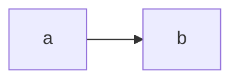
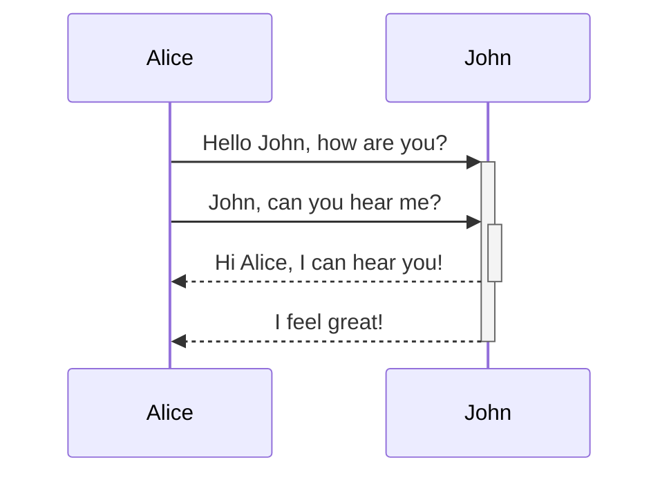

> [!note]
> Mermaid diagrams currently only work with MDX rendering. See how to enable it globally or per page: https://flowershow.app/blog/announcing-syntax-mode-configuration

## How to use

To create a mermaid diagram you embed inside a special code block with the type of `mermaid` i.e.

````md
```mermaid

MERMAID DIAGRAM CODE GOES HERE

```
````

## Examples

### Simple example

````md

````

This renders like this:


### Sequence example

Here's a more complex example of a sequence diagram:

````md

````

This renders like this:


You can read more about Mermaid diagrams on the [Mermaid website](https://mermaid.js.org/)..
