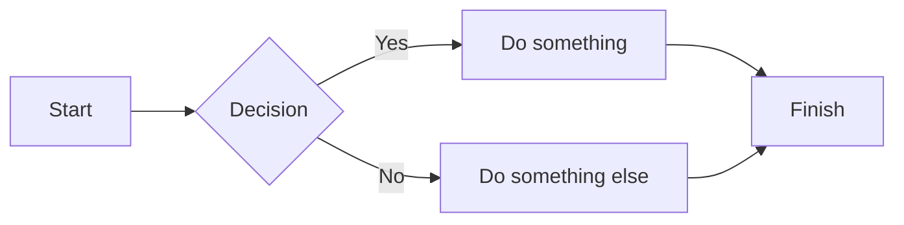

> [!tip]
> This page shows rendered output for every supported syntax element. For syntax reference and code examples, see [[syntax|Markdown Syntax Support]].

---

## Text formatting

**Bold text** and *italic text* and ***bold italic***.

~~Strikethrough~~ and ==highlighted text== and `inline code`.

Subscript: H~2~O · Superscript: x^2^

---

## Headings

# Heading 1
## Heading 2
### Heading 3
#### Heading 4
##### Heading 5
###### Heading 6

---

## Blockquotes

> A simple blockquote.

> Blockquote with **bold**, *italic*, and `inline code`.
>
> Multiple paragraphs — still one blockquote.

> Level 1
>> Level 2
>>> Level 3

---

## Lists

### Unordered

- Item one
- Item two
  - Nested item A
  - Nested item B
- Item three

### Ordered

1. First item
2. Second item
   - A note
   - Another note
3. Third item

### Task list

- [x] Completed task
- [ ] Pending task
  - [ ] Sub-task

---

## Code

Inline: use `const x = 42` in your code.

```js
function greet(name) {
  return `Hello, ${name}!`;
}
```

```python
class Example:
    def code(self, test):
        return 'Code highlighter'
```

```bash
npm install && npm run dev
```

---

## Tables

| Feature | Supported |
|---|---|
| CommonMark | ✅ |
| GitHub Flavoured Markdown | ✅ |
| Obsidian wikilinks | ✅ |
| Math (KaTeX) | ✅ |
| Mermaid diagrams | ✅ |

| Left | Center | Right |
|:--|:--:|--:|
| apple | banana | cherry |
| dog | cat | bird |

---

## Links

[Standard Markdown link](/docs)

[[syntax|Obsidian wikilink with alias]]

https://flowershow.app (autolink)

---

## Images


![[hiroshige.jpg|Hiroshige art]]

Resized: ![[hiroshige.jpg|300]]

---

## Math

Inline: $E = mc^2$

Block:

$$
\int_0^\infty e^{-x^2} dx = \frac{\sqrt{\pi}}{2}
$$

---

## Mermaid diagrams



---

## Callouts

> [!note]
> A note callout with **bold** and `code`.

> [!tip] Pro tip
> Use callouts to highlight important information.

> [!warning] Watch out
> This is a warning callout.

> [!important] Required
> This callout signals something critical.

> [!faq]- Foldable callout (click to expand)
> This content is hidden until the callout is expanded.

> [!question] Can callouts be nested?
> > [!todo] Yes! Like this.

---

## Footnotes

Flowershow supports footnotes[^1] for references and annotations[^2].

[^1]: This is the first footnote.
[^2]: This is the second footnote, which can contain *formatting* too.

---

## Horizontal rules

---

___

***

---

## Typographic conversions

- Em dash: A---B → A---B
- En dash: 2020--2025 → 2020--2025
- Ellipsis: Wait for it... → Wait for it...

---

## Comments (MDX mode)

{/* This comment is invisible in the rendered page */}

Text before {/* inline invisible comment */} text after.

---

## Obsidian-style comments

This %%word%% is invisible.

%%
This entire paragraph is invisible.
%%

---

> [!info] More syntax details
> See the full reference at [[syntax|Markdown Syntax Support]] and the [[syntax-mode|Syntax Mode Configuration]] docs.
