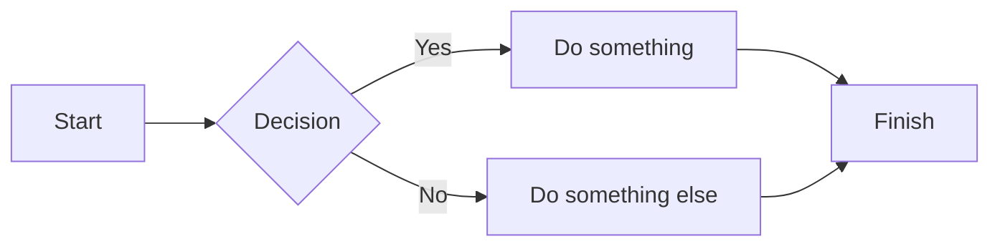

> [!tip] Choose Markdown or MDX rendering mode
> Flowershow lets you choose between Markdown and MDX rendering modes. If you're publishing plain Markdown content and experience parsing issues, see [[syntax-mode|Syntax Mode Configuration]] to learn how to switch modes.

Flowershow was designed with Obsidian users in mind, and so, it aims to fully support Obsidian syntax, including **CommonMark**, **GitHub Flavoured Markdown** and **Obsidian extensions**, like Wiki links.

## Headings

In Markdown you can create headings in two main ways — ATX style (with `#`) and Setext style (with `=` and `-`).

### ATX Headings

Use 1–6 `#` symbols:
```
# Heading 1
## Heading 2
### Heading 3
#### Heading 4
##### Heading 5
###### Heading 6
```

> [!note]
> A space after `#` is required (`## Heading` not `##Heading`)

### Setext Headings

Only for H1 and H2 — underline with `=` or `-`:

```
Heading 1
===============

Heading 2
---------------
```

> [!note]
> Headings automatically generate anchors for linking, like:
> `[Jump to section](#my-heading)`
> You can get the full URL of a heading by hovering over it and clicking on the `#` icon on the left.

> [!tip]
> It's recommended to use H1 only once per page for proper HTML semantics.

## Thematic breaks

Thematic breaks can be made with three `*`, `-` or `_`.

**Example:**

```
***
---
___
```

***
---
___

## Emphasis

**I'm Bold!** is done with `**I'm Bold!**`
**I'm Bold!** is done with `__I'm Bold!__`

*I'm Italic!* is done with `*I'm Italic!*`
*I'm Italic!* is done with `_I'm Italic!_`

*Italic with **bold** inside* is done with `*Italic with **bold** inside*`
_Italic with __bold__ inside_ is done with `_Italic with __bold__ inside_`

~~Strikethrough~~ is done with `~~Strikethrough~~`
==Highlight== is done with `==Highlight==`
`Inline code` is done with ``Inline code``

## Paragraphs & Line breaks

### New paragraph

To start a new paragraph, leave a blank line between lines of text:

```
This is paragraph one.

This is paragraph two.
```

This is paragraph one.

This is paragraph two.

### Soft Line Break (line break within the same paragraph)

A soft line break is just a newline in your editor and markdown treats it as a space.

```
Line one
Line two (still same paragraph)
```

Line one
Line two (still same paragraph)

### Hard Line Break (force a line break)

To force a break without starting a new paragraph, use two spaces at the end of a line or a backslash (`\`):

**Option 1: Two spaces at end**
```
Line one
Line two
```

Line one
Line two

**Option 2: Backslash**
```
Line one\
Line two
```

Line one\
Line two

## Blockquotes

Blockquotes in Markdown let you quote text like a citation.
They work by prefixing lines with `>`.

**Basic blockquote**

```
> This is a quote.
```

> This is a quote.

**Nested blockquotes (multi-level)**

Add another > for each level:

```
> Level 1
>> Level 2
>>> Level 3
```

> Level 1
>> Level 2
>>> Level 3

**Blockquote with multiple paragraphs**

Leave a blank line inside and prefix every paragraph with `>`:

```
> This is the first paragraph of a quote.
>
> This is the second paragraph.
```

> This is the first paragraph of a quote.
>
> This is the second paragraph.

**Blockquote with other elements (lists/code)**

Markdown inside still works:
```
> Shopping list:
> - Apples
> - Bananas
```

> Shopping list:
> - Apples
> - Bananas

or code:
```
> Code inside a quote:
>
> ```js
> console.log("Hi");
> ```
```

> Code inside a quote:
>
> ```js
> console.log("Hi");
> ```

## Lists

Markdown supports two main types of lists: **unordered** (bulleted) and **ordered** (numbered). You can also nest lists and mix types.

### Unordered Lists (bullets)

Use `-`, `*`, or `+` — they all work the same:

```
- Item one
- Item two
- Item three
```

- Item one
- Item two
- Item three

### Ordered Lists (numbered)

```
1. First item
2. Second item
3. Third item
```

1. First item
2. Second item
3. Third item

### Nested Lists

Indent sub-items with two or four spaces:
```
- Groceries
    - Apples
    - Bananas
- Chores
    - Laundry
    - Dishes
```

- Groceries
    - Apples
    - Bananas
- Chores
    - Laundry
    - Dishes

### Mixed Lists

```
1. Step one
2. Step two
   - Note A
   - Note B
3. Step three
```

1. Step one
2. Step two
   - Note A
   - Note B
3. Step three

### Task Lists

```
- [x] one thing to do
- [ ] a second thing to do
  - [ ] another thing to do!
```

- [x] one thing to do
- [ ] a second thing to do
  - [ ] another thing to do!

## Code

### Inline code

Use backticks for short code snippets inside a sentence:

```
Use the `print()` function.
```

Use the `print()` function.

### Fenced code blocks (multi-line)

Wrap code in triple backticks:

````
```
const greeting = "Hello!"; console.log(greeting);
```
````

Renders as:
```
const greeting = "Hello!"; console.log(greeting);
```

**Syntax highlighting**

Specify a language after the backticks to get syntax highlighting:

````
```python
class Example:
	def code(self,test):
		return 'Code highlighter'
```
````

Renders as:
```python
class Example:
	def code(self,test):
		return 'Code highlighter'
```

### Inline code

```
Here is some code: `print("hello world!")`
```

Here is some code: `print("hello world!")`


## Tables

You include tables in Markdown using pipes `|` to separate columns and dashes `-` to define the header row.

**Basic Markdown table**

```
| Name   | Age | City       |
|--------|-----|------------|
| Alice  | 30  | Lausanne   |
| Bob    | 28  | Warsaw     |
| Clara  | 32  | Amsterdam  |
```

| Name   | Age | City       |
|--------|-----|------------|
| Alice  | 30  | Lausanne   |
| Bob    | 28  | Warsaw     |
| Clara  | 32  | Amsterdam  |

**Alignment**

Use `:` to align text:

```
| Left Align | Center Align | Right Align |
|:-----------|:------------:|------------:|
| apple      | banana       | cherry      |
| dog        | cat          | bird        |
```

| Left Align | Center Align | Right Align |
|:-----------|:------------:|------------:|
| apple      | banana       | cherry      |
| dog        | cat          | bird        |

**With inline formatting**

```
| Feature     | Supported |
|-------------|----------|
| **Bold**     | ✅       |
| `Code`       | ✅       |
| [[Wikilinks]]| ✅       |
```

| Feature     | Supported |
|-------------|----------|
| **Bold**     | ✅       |
| `Code`       | ✅       |
| [[Wikilinks]]| ✅       |

## Links

### CommonMark Links

Use `[text](url)` format:

```
[Read the blog post](/blog/turn-obsidian-vault-into-a-blog.md)
```

[Read the blog post](/blog/turn-obsidian-vault-into-a-blog.md)

#### Reference-style links

```
See the [docs][docs-link].

[docs-link]: https://flowershow.app/docs
```

See the [docs][docs-link].

[docs-link]: https://flowershow.app/docs

### Obsidian Wikilinks

Obsidian uses `[[ ]]` for internal links.

**Link to a page**

You can use Obsidian's "shortest possible path" style links:
```
[[turn-obsidian-vault-into-a-blog]]
```

[[turn-obsidian-vault-into-a-blog]]

**With alias**

```
[[turn-obsidian-vault-into-a-blog|Publish a blog directly from Obsidian with Flowershow]]
```

[[turn-obsidian-vault-into-a-blog|Publish a blog directly from Obsidian with Flowershow]]

## Images

### CommonMark image embeds

Basic format:
```

```


With title:
```

```


### Image resizing with CommonMark syntax

You can use Obsidian's resizing syntax with CommonMark image links:

Width only:

```

```


Width and height:

```

```


### Obsidian image embeds

You can use Obsidian's "shortest possible path" style links:
```
![[hiroshige.jpg]]
```

![[hiroshige.jpg]]

Alias (alt text override):
```
![[hiroshige.jpg|Hiroshige art]]
```

### Image resizing Obsidian-style

![[hiroshige.jpg|Hiroshige art]]

Set width:
```
![[hiroshige.jpg|200]]
```

![[hiroshige.jpg|200]]

Or both width and height:
```
![[hiroshige.jpg|300x200]]
```

![[hiroshige.jpg|300x200]]

## Other media files

Flowershow supports Obsidian’s media embeds using `![[...]]`.

Audio:
```
![[sample.mp3]]
```

![[sample.mp3]]


Video:
```
![[sample.mp4]]
```

![[sample.mp4]]

PDF:
```
![[sample.pdf]]
```

![[sample.pdf]]

> [!note] Coming soon: Note transclusions
> Just like in Obsidian, Flowershow will soon support embedding one note inside another:
> ```
> ![[my-note]]
> ```

## Autolinks

Bare URLs and email addresses are detected and turned into links.

```
Check out Flowershow at https://flowershow.app!

ola@example.com
```

Check out Flowershow at https://flowershow.app!

ola@example.com

### YouTube

YouTube video links will be auto-embedded.
```
https://youtu.be/ZbQRlNm2dww
```

https://youtu.be/ZbQRlNm2dww

## Footnotes

```
Roses are red... [^1]

[^1]: ...violets are blue.
```

Roses are red... [^1]

[^1]: ...violets are blue.

## Math

Flowershow supports math expressions using LaTeX-style syntax (powered by KaTeX).

### Inline math

Wrap math in single `$`:

```
The equation $E = mc^2$ is famous.
```

The equation $E = mc^2$ is famous.

### Block math

Use double $$ for a displayed equation:

```
$$
\frac{d}{dx} (x^2) = 2x
$$
```

$$
\frac{d}{dx} (x^2) = 2x
$$

> [!note] Reference
> Full supported syntax: [KaTeX docs](https://katex.org/docs/support_table.html).

## Mermaid diagrams

Embed your diagram inside a code block with `mermaid` type.

**Example:**

````

````


> [!note]
> You can find more examples and syntax on the [Mermaid website](https://mermaid.js.org/).

## Obsidian Bases (Beta)

Flowershow now supports **Obsidian Bases**, a powerful feature that allows you to create dynamic, queryable views of your notes directly in your published sites.

> [!important]
> Obsidian Bases blocks are parsed in MDX mode.
> To make them work, use one of these options:
> - Set your site's global syntax mode to `mdx`
> - Set `syntaxMode: mdx` in the page frontmatter
> - Use a `.mdx` file extension (when your global syntax mode is `auto`)
>
> See [[syntax-mode|Syntax Mode Configuration]] for details.

**Example:**

````
```base
filters:
  or:
     - file.hasProperty("status")
     - file.inFolder("Projects")
views:
  - type: table
    name: "All Items"
    order:
      - file.name
      - status
```
````

👉 See [[announcing-obsidian-bases-beta|Announcing Obsidian Bases Support]] to learn more.

## Automatic punctuation conversions

Flowershow automatically converts certain character sequences into typographic symbols, just like Obsidian and many Markdown engines.

### ndash / mdash

| Input | Output | Meaning                          |
| ----- | ------ | -------------------------------- |
| `--`  | --      | en-dash (range, e.g., 2020–2025) |
| `---` | ---      | em-dash (sentence break)         |

```
2020--2025
A---B
```

2020--2025
A---B

### Ellipsis

| Input   | Output | Meaning         |
| ------- | ------ | --------------- |
| `...`   | ...      | ellipsis        |
| `. . .` | . . .      | spaced ellipsis |

```
Wait for it...
Or like this: . . .
```

Wait for it...
Or like this: . . .

## Obsidian Callouts

```
> [!info] This is cool!
> Here's a callout block.
> It supports **markdown** and [[abc|wikilinks]].
```

> [!info] This is cool!
> Here's a callout block.
> It supports **markdown** and [[abc|wikilinks]].

```
> [!tip] Title-only callout
```

> [!tip] Title-only callout

```
> [!faq]- Are callouts foldable?
> Yes! In a foldable callout, the contents are hidden when the callout is collapsed.
```

> [!faq]- Are callouts foldable?
> Yes! In a foldable callout, the contents are hidden when the callout is collapsed.

```
> [!question] Can callouts be nested?
> > [!todo] Yes!, they can.
> > > [!example]  You can even use multiple layers of nesting.
```

> [!question] Can callouts be nested?
> > [!todo] Yes!, they can.
> > > [!example]  You can even use multiple layers of nesting.

> [!note] Supported callout types
> Flowershow supports 13 different Obsidian callout types like note, abstract, todo, or tip. See this [Obsidian docs page](https://help.obsidian.md/How+to/Use+callouts) to learn more about different callout types. Aliases work too!

## Comments

### MDX comment syntax

When using MDX rendering, you can add invisible comments using JSX style:

**Example:**

```
Here is some invisible inline comment: {/* comment! */}

Here is an invisible multiline comment:

{/*
multi
line
comment!
*/}
```

Here is some invisible inline comment: {/* comment! */}

Here is an invisible multiline comment:

{/*
multi
line
comment!
*/}

### Obsidian comments

#### Inline comments

```
This %%word%% is invisible
```

This %%word%% is invisible

#### Multi-line

```
The paragraph below is invisible:

%%
I'm invisible!
%%
```

The paragraph below is invisible:

%%
I'm invisible!
%%

---

> [!NOTE]
> 🔍 To learn more about the Markdown syntax refer to the [CommonMark specification](https://spec.commonmark.org/0.30/).

> [!NOTE]
> 🔍 To learn more about the GitHub Flavored Markdown syntax refer to the [GFM specification](https://github.github.com/gfm/).

---

Flowershow strives for full compatibility with:

- ✅ CommonMark
- ✅ GitHub-Flavored Markdown (GFM)
- ✅ Core Obsidian syntax (and some extensions)

We work hard to ensure everything works the way you expect.
If you notice anything missing or behaving differently than Obsidian/GFM/CommonMark, please let us know:

- 💬 Join our Discord community
- 🗨️ Leave a comment below
- 🐛 Or open an issue on GitHub

Your feedback helps us improve Flowershow for everyone — thank you!
