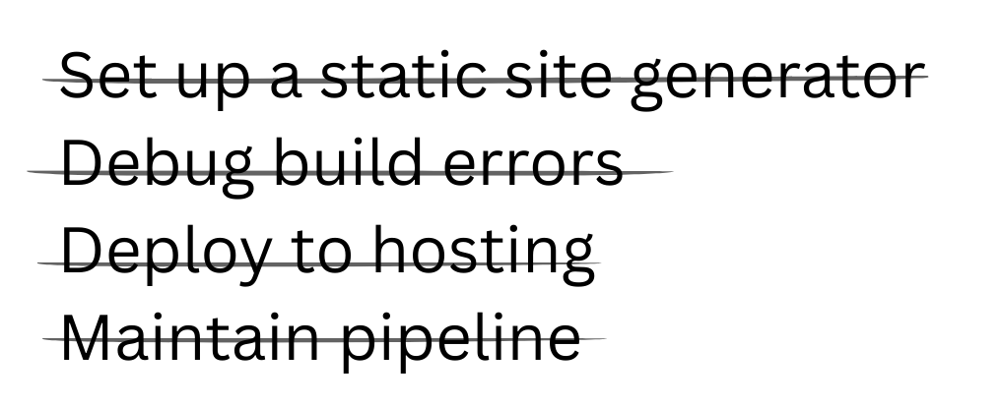
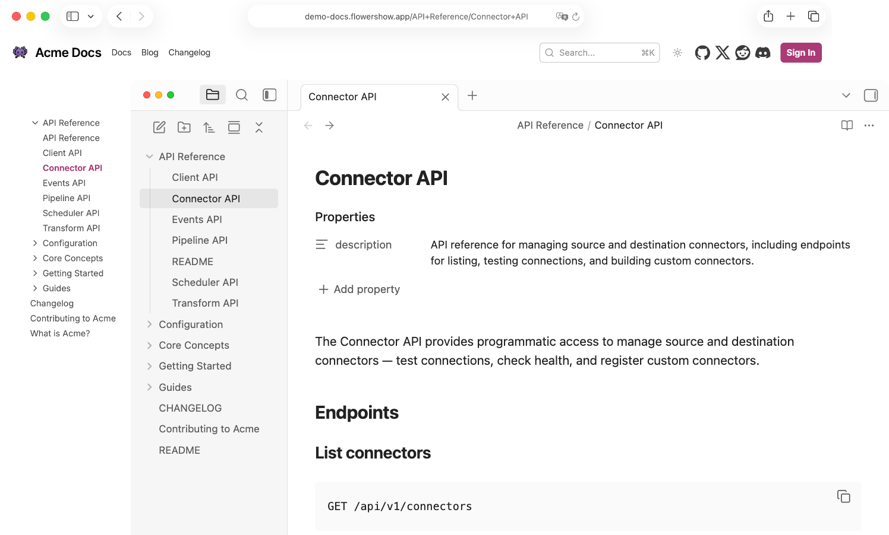
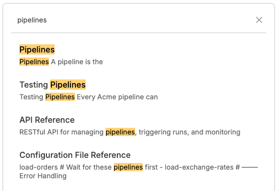
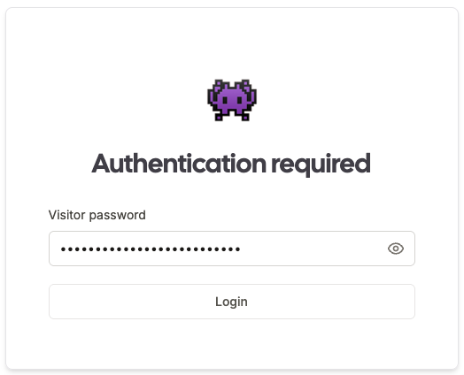
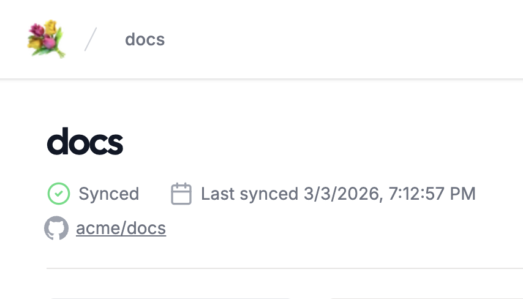
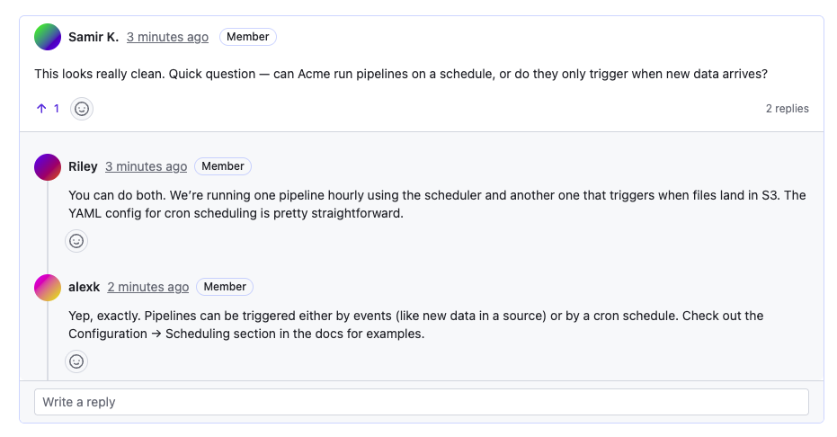

  

    

      

        

          <h1 className="text-balance text-5xl font-semibold tracking-tight text-gray-900 sm:text-6xl"> Publish your docs. 
             Skip the stack.
          </h1>
          
 Turn a folder of Markdown files into a live docs site, in seconds.

          

            <a
              href="https://cloud.flowershow.app/login"
              className="rounded-md bg-[#AB3A76] px-3.5 py-2.5 text-sm font-semibold text-white hover:bg-[#C06B98] focus-visible:outline focus-visible:outline-2 focus-visible:outline-offset-2 focus-visible:outline-[#AB3A76]"
            >Get started for free →</a>
            <a
              href="https://demo-docs.flowershow.app/"
              className="rounded-md bg-white px-3.5 py-2.5 text-sm font-semibold text-gray-900 ring-1 ring-inset ring-gray-300 hover:bg-gray-50"
            >See demo</a>
          

        

        <video
          src="./docs-demo.mp4"
          autoPlay=""
          loop=""
          muted=""
          playsInline=""
          className="mt-8 rounded-md ring-1 ring-gray-900/10 sm:mt-12 w-full"
        ></video>
        

          990+ sites published &nbsp;·&nbsp;
          Free plan{" "}
          — forever.
        

      

    

  

  

    

      <h2 className="text-4xl font-semibold tracking-tight text-gray-900 sm:text-5xl"> Publish from wherever your docs live.</h2>
      
 Pick one. You can switch later.

    

    

      <a
        href="/blog/how-to-publish-repository-with-markdown"
        className="group flex flex-col rounded-2xl bg-white p-8 shadow-sm ring-1 ring-gray-200/80 transition duration-200hover:shadow-md hover:ring-[#E2BACF]"
      >
        

          <svg
            className="h-6 w-6 text-[#AB3A76]"
            fill="currentColor"
            viewBox="0 0 24 24"
          ><path
              fillRule="evenodd"
              clipRule="evenodd"
              d="M12 2C6.48 2 2 6.48 2 12a10 10 0 006.84 9.49c.5.09.68-.22.68-.48
      0-.24-.01-.87-.01-1.71-2.78.6-3.37-1.34-3.37-1.34-.45-1.14-1.1-1.44-1.1-1.44
      -.9-.62.07-.61.07-.61 1 .07 1.53 1.03 1.53 1.03.88 1.5 2.31 1.07 2.87.82
      .09-.64.35-1.07.63-1.31-2.22-.25-4.56-1.11-4.56-4.95
      0-1.09.39-1.98 1.03-2.68-.1-.25-.45-1.27.1-2.65
      0 0 .84-.27 2.75 1.02A9.56 9.56 0 0112 6.84c.85.004 1.7.115 2.5.337
      1.9-1.29 2.74-1.02 2.74-1.02.55 1.38.2 2.4.1 2.65
      .64.7 1.02 1.59 1.02 2.68 0 3.85-2.34 4.7-4.57 4.95
      .36.31.67.92.67 1.85 0 1.33-.01 2.4-.01 2.73
      0 .27.18.58.69.48A10 10 0 0022 12c0-5.52-4.48-10-10-10z"/></svg>
        

        <h3 className="mt-6 text-base font-semibold text-gray-900">Connect GitHub</h3>
        
 Keep docs in your repo.  Push changes — they auto-sync.

         Get started →
      </a>
      <a
        href="/docs"
        className="group flex flex-col rounded-2xl bg-white p-8 shadow-sm ring-1 ring-gray-200/80 transition duration-200hover:shadow-md hover:ring-[#E2BACF]"
      >
        

          <svg
            className="h-6 w-6 text-[#AB3A76]"
            fill="none"
            stroke="currentColor"
            strokeWidth="1.5"
            viewBox="0 0 24 24"
          ><path
              strokeLinecap="round"
              strokeLinejoin="round"
              d="M3 7.5A2.25 2.25 0 015.25 5.25H9l1.5 1.5h8.25A2.25 2.25 0 0121 9v7.5A2.25 2.25 0 0118.75 18.75H5.25A2.25 2.25 0 013 16.5V7.5z"/></svg>
        

        <h3 className="mt-6 text-base font-semibold text-gray-900">Upload a folder</h3>
        
Drag in your Markdown files. Get a site link instantly.

         Get started →
      </a>
      <a
        href="/uses/obsidian"
        className="group flex flex-col rounded-2xl bg-white p-8 shadow-sm ring-1 ring-gray-200/80 transition duration-200hover:shadow-md hover:ring-[#E2BACF]"
      >
        

          <svg
            className="h-6 w-6 text-[#AB3A76]"
            aria-hidden="true"
            role="img"
            viewBox="0 0 24 24"
            xmlns="http://www.w3.org/2000/svg"
            stroke="none"
            fill="currentColor"
          ><path d="M19.355 18.538a68.967 68.959 0 0 0 1.858-2.954.81.81 0 0 0-.062-.9c-.516-.685-1.504-2.075-2.042-3.362-.553-1.321-.636-3.375-.64-4.377a1.707 1.707 0 0 0-.358-1.05l-3.198-4.064a3.744 3.744 0 0 1-.076.543c-.106.503-.307 1.004-.536 1.5-.134.29-.29.6-.446.914l-.31.626c-.516 1.068-.997 2.227-1.132 3.59-.124 1.26.046 2.73.815 4.481.128.011.257.025.386.044a6.363 6.363 0 0 1 3.326 1.505c.916.79 1.744 1.922 2.415 3.5zM8.199 22.569c.073.012.146.02.22.02.78.024 2.095.092 3.16.29.87.16 2.593.64 4.01 1.055 1.083.316 2.198-.548 2.355-1.664.114-.814.33-1.735.725-2.58l-.01.005c-.67-1.87-1.522-3.078-2.416-3.849a5.295 5.295 0 0 0-2.778-1.257c-1.54-.216-2.952.19-3.84.45.532 2.218.368 4.829-1.425 7.531zM5.533 9.938c-.023.1-.056.197-.098.29L2.82 16.059a1.602 1.602 0 0 0 .313 1.772l4.116 4.24c2.103-3.101 1.796-6.02.836-8.3-.728-1.73-1.832-3.081-2.55-3.831zM9.32 14.01c.615-.183 1.606-.465 2.745-.534-.683-1.725-.848-3.233-.716-4.577.154-1.552.7-2.847 1.235-3.95.113-.235.223-.454.328-.664.149-.297.288-.577.419-.86.217-.47.379-.885.46-1.27.08-.38.08-.72-.014-1.043-.095-.325-.297-.675-.68-1.06a1.6 1.6 0 0 0-1.475.36l-4.95 4.452a1.602 1.602 0 0 0-.513.952l-.427 2.83c.672.59 2.328 2.316 3.335 4.711.09.21.175.43.253.653z" /></svg>
        

        <h3 className="mt-6 text-base font-semibold text-gray-900">Publish from Obsidian</h3>
        
 Keep writing in your vault. Publish with our official Obsidian plugin.  

         Get started → 
      </a>
      <a
        href="/docs/cli"
        className="group flex flex-col rounded-2xl bg-white p-8 shadow-sm ring-1 ring-gray-200/80 transition duration-200hover:shadow-md hover:ring-[#E2BACF]"
      >
        

          <svg
            xmlns="http://www.w3.org/2000/svg"
            viewBox="0 0 24 24"
            strokeWidth={2}
            strokeLinecap="round"
            strokeLinejoin="round"
            className="h-6 w-6 text-[#AB3A76]"
            fill="none"
            stroke="currentColor"
          ><path d="M12 19h8" /><path d="m4 17 6-6-6-6" /></svg>
        

        <h3 className="mt-6 text-base font-semibold text-gray-900"> Use the CLI </h3>
        
Publish from the terminal. Script it if you want.

        Get started →
      </a>
    

  

  

    

      

        <h2 className="text-pretty text-4xl font-semibold tracking-tight text-gray-900 sm:text-5xl">No setup ceremony.</h2>
        
        
Upload your files. That's enough.

      

    

    

      <video
        src="./docs-github-publish.mp4"
        autoPlay=""
        loop=""
        muted=""
        playsInline=""
        className="w-full max-w-full rounded-xl ring-1 ring-gray-400/10"></video>
    

  

  

    <h2 className="mt-2 max-w-5xl text-pretty text-4xl font-semibold tracking-tight text-gray-900 sm:text-5xl">Everything a documentation site should have.</h2>
    

      

        

          

            

              
            

          

          

            <h3 className="mt-2 text-lg font-medium tracking-tight text-gray-900">
              Clear navigation from your folder structure
            </h3>
            

              Your folders become sections. Your files become pages. URLs
              follow the same structure. No separate navigation config.
            

            <a
              href="/docs/sidebar"
              className="mt-4 inline-block text-sm font-medium text-[#AB3A76]"
            >Learn more →</a>
          

        

      

      

        

          

            

              
            

          

          

            

              Built-in search
            

            

              Press ⌘K and find what you need instantly.
            

            <a
              href="/blog/announcing-full-text-search"
              className="mt-4 inline-block text-sm font-medium text-[#AB3A76]"
            >Learn more →</a>
          

        

      

      

        

          

            

              
            

          

          

            <h3 className="mt-2 text-lg font-medium tracking-tight text-gray-900">
              Public or private
            </h3>
            

              Make your docs public. Or keep them internal.
            

            <a
              href="/blog/announcing-password-protection"
              className="mt-4 inline-block text-sm font-medium text-[#AB3A76]"
            >Learn more →</a>
          

        

      

      

        

          

            

              
            

          

          

            <h3 className="mt-2 text-lg font-medium tracking-tight text-gray-900">
              Updates in seconds
            </h3>
            

              Push to GitHub. Run the CLI. Sync from Obsidian. Refresh the
              page. It's live. No rebuild ritual. No “deployment in progress”
              anxiety.
            

          

        

      

      

        

          

            

              
            

          

          

            <h3 className="mt-2 text-lg font-medium tracking-tight text-gray-900">
              Comments
            </h3>
            
Feedback, questions, discussions — right on the page.

            <a
              href="/docs/comments"
              className="mt-4 inline-block text-sm font-medium text-[#AB3A76]"
            >Learn more →</a>
          

        

      

    

  

  

    

      <h2 className="text-pretty text-4xl font-semibold tracking-tight text-gray-900 sm:text-5xl">Markdown — with room to grow.</h2>
      
Start with plain Markdown. Add richer blocks when they help. Your docs stay readable as files — not trapped in a proprietary editor.
      

    

    

      

        <video
          src="./docs-syntax.mp4"
          autoPlay=""
          loop=""
          muted=""
          playsInline=""
          className="rounded-md ring-1 ring-gray-900/10 w-full"
        />
      

      

        <dl className="space-y-6">
          

            <dt className="text-base font-semibold text-gray-900">Callouts</dt>
            <dd className="mt-1 text-sm text-gray-600">Notes, warnings, tips — the bits people skim for.</dd>
          

          

            <dt className="text-base font-semibold text-gray-900">Math</dt>
            <dd className="mt-1 text-sm text-gray-600">Render mathematical expressions inline or as blocks.</dd>
          

          

            <dt className="text-base font-semibold text-gray-900">Code blocks</dt>
            <dd className="mt-1 text-sm text-gray-600">Syntax highlighting, readable formatting, and copy when you need it.</dd>
          

          

            <dt className="text-base font-semibold text-gray-900">Mermaid diagrams</dt>
            <dd className="mt-1 text-sm text-gray-600">Flowcharts, sequence diagrams, and simple system maps — inlinein your docs.</dd>
          

          

            <dt className="text-base font-semibold text-gray-900">Charts</dt>
            <dd className="mt-1 text-sm text-gray-600">Add simple charts when numbers explain faster than paragraphs.</dd>
          

          

            <dt className="text-base font-semibold text-gray-900">HTML / JSX blocks</dt>
            <dd className="mt-1 text-sm text-gray-600">When Markdown isn’t enough, embed a custom block and move on.</dd>
          

        </dl>
        

          <a
            href="/docs/syntax"
            className="rounded-md bg-gray-900 px-4 py-2.5 text-sm font-semibold text-white shadow-sm hover:bg-gray-800"
          >See supported syntax</a>
        

      

    

  

  

    

      

        

          <h2 className="mt-2 text-pretty text-4xl font-semibold tracking-tight text-gray-900 sm:text-5xl">Make it yours.</h2>
          
Flowershow is intentionally minimal. But you still get the few knobs that matter — branding, domains, and a place for your own CSS.

          <dl className="mt-10 max-w-xl space-y-8 text-base/7 text-gray-600 lg:max-w-none">
            

              <svg
                xmlns="http://www.w3.org/2000/svg"
                className="h-6 w-6 text-[#AB3A76] absolute left-0 top-1"
                viewBox="0 0 24 24"
                fill="none"
                stroke="currentColor"
                strokeWidth={2}
                strokeLinecap="round"
                strokeLinejoin="round"
              ><circle cx={12} cy={12} r={10} /><path d="M12 2a14.5 14.5 0 0 0 0 20 14.5 14.5 0 0 0 0-20" /> <path d="M2 12h20" /> </svg>
              <dt className="inline font-semibold text-gray-900"> Bring your domain.</dt>
              <dd className="inline"> {" "} Keep links stable. Make it feel professional.</dd>
            

            

              <svg
                xmlns="http://www.w3.org/2000/svg"
                className="h-6 w-6 text-[#AB3A76] absolute left-0 top-1"
                viewBox="0 0 24 24"
                fill="none"
                stroke="currentColor"
                strokeWidth={2}
                strokeLinecap="round"
                strokeLinejoin="round"
              > <rect width={18} height={18} x={3} y={3} rx={2} ry={2} /> <circle cx={9} cy={9} r={2} /> <path d="m21 15-3.086-3.086a2 2 0 0 0-2.828 0L6 21" /> </svg>
              <dt className="inline font-semibold text-gray-900"> Change logo, favicons, thumbnails, and more.</dt>
              <dd className="inline"> {" "} Make your project visually distinct and recognizable.</dd>
            

            

              <svg
                xmlns="http://www.w3.org/2000/svg"
                className="h-6 w-6 text-[#AB3A76] absolute left-0 top-1"
                viewBox="0 0 24 24"
                fill="none"
                stroke="currentColor"
                strokeWidth={2}
                strokeLinecap="round"
                strokeLinejoin="round"
              > <path d="M12 22a1 1 0 0 1 0-20 10 9 0 0 1 10 9 5 5 0 0 1-5 5h-2.25a1.75 1.75 0 0 0-1.4 2.8l.3.4a1.75 1.75 0 0 1-1.4 2.8z" /> <circle cx="13.5" cy="6.5" r=".5" fill="currentColor" /> <circle cx="17.5" cy="10.5" r=".5" fill="currentColor" /> <circle cx="6.5" cy="12.5" r=".5" fill="currentColor" /> <circle cx="8.5" cy="7.5" r=".5" fill="currentColor" /> </svg>
              <dt className="inline font-semibold text-gray-900"> Custom theme.</dt>
              <dd className="inline"> {" "} Choose from official Flowershow themes or create your own CSS theme for full control over spacing, colors, typography, and components.</dd>
            

          </dl>
          

            <a
              href="https://github.com/flowershow/themes"
              className="rounded-md bg-gray-900 px-4 py-2.5 text-sm font-semibold text-white shadow-sm hover:bg-gray-800">Browse official themes</a>
          

          
 Created a theme you're proud of? Share it with the community!

        

      

      <video
        autoPlay=""
        loop=""
        muted=""
        playsInline=""
        src="./docs-theme.mp4"
        alt="Product screenshot"
        className="w-[48rem] max-w-none rounded-xl ring-1 ring-gray-400/10 sm:w-[57rem] md:-ml-4 lg:-ml-0"
      ></video>
    

  

  

    

      <h2 className="text-4xl font-semibold tracking-tight text-gray-900 sm:text-5xl"> Frequently asked questions</h2>
      <dl className="mt-16 divide-y divide-gray-900/10">
        

          <dt>
            <button
              type="button"
              command="--toggle"
              commandfor="faq-0"
              className="flex w-full items-start justify-between text-left text-gray-900"
            >
               Do I need to configure anything before publishing?
              
                <svg
                  viewBox="0 0 24 24"
                  fill="none"
                  stroke="currentColor"
                  strokeWidth="1.5"
                  aria-hidden="true"
                  className="size-6 [[aria-expanded='true']_&]:hidden"
                >
                  <path
                    d="M12 6v12m6-6H6"
                    strokeLinecap="round"
                    strokeLinejoin="round"
                  />
                </svg>
                <svg
                  viewBox="0 0 24 24"
                  fill="none"
                  stroke="currentColor"
                  strokeWidth="1.5"
                  aria-hidden="true"
                  className="size-6 [&:not([aria-expanded='true']_*)]:hidden"
                >
                  <path
                    d="M18 12H6"
                    strokeLinecap="round"
                    strokeLinejoin="round"
                  />
                </svg>
              
            </button>
          </dt>
          <el-disclosure id="faq-0" className="[&:not([hidden])]:contents">
            <dd className="mt-2 pr-12">
              
 No. Upload your Markdown files or connect a GitHub repository.  Navigation is generated from your folders and your site is live in seconds. There’s no theme setup or build pipeline to manage.

            </dd>
          </el-disclosure>
        

        

          <dt>
            <button
              type="button"
              command="--toggle"
              commandfor="faq-1"
              className="flex w-full items-start justify-between text-left text-gray-900"
            >
               How do updates work?
              
                <svg
                  viewBox="0 0 24 24"
                  fill="none"
                  stroke="currentColor"
                  strokeWidth="1.5"
                  aria-hidden="true"
                  className="size-6 [[aria-expanded='true']_&]:hidden"
                >
                  <path
                    d="M12 6v12m6-6H6"
                    strokeLinecap="round"
                    strokeLinejoin="round"
                  />
                </svg>
                <svg
                  viewBox="0 0 24 24"
                  fill="none"
                  stroke="currentColor"
                  strokeWidth="1.5"
                  aria-hidden="true"
                  className="size-6 [&:not([aria-expanded='true']_*)]:hidden"
                >
                  <path
                    d="M18 12H6"
                    strokeLinecap="round"
                    strokeLinejoin="round"
                  />
                </svg>
              
            </button>
          </dt>
          <el-disclosure
            id="faq-1"
            hidden=""
            className="[&:not([hidden])]:contents"
          >
            <dd className="mt-2 pr-12">
              
 Push to GitHub. Or sync via CLI or Obsidian. Refresh the page — your changes are there. No manual deployment step.

            </dd>
          </el-disclosure>
        

        

          <dt>
            <button
              type="button"
              command="--toggle"
              commandfor="faq-2"
              className="flex w-full items-start justify-between text-left text-gray-900"
            >
               Can I keep my documentation in GitHub?
              
                <svg
                  viewBox="0 0 24 24"
                  fill="none"
                  stroke="currentColor"
                  strokeWidth="1.5"
                  aria-hidden="true"
                  className="size-6 [[aria-expanded='true']_&]:hidden"
                >
                  <path
                    d="M12 6v12m6-6H6"
                    strokeLinecap="round"
                    strokeLinejoin="round"
                  />
                </svg>
                <svg
                  viewBox="0 0 24 24"
                  fill="none"
                  stroke="currentColor"
                  strokeWidth="1.5"
                  aria-hidden="true"
                  className="size-6 [&:not([aria-expanded='true']_*)]:hidden"
                >
                  <path
                    d="M18 12H6"
                    strokeLinecap="round"
                    strokeLinejoin="round"
                  />
                </svg>
              
            </button>
          </dt>
          <el-disclosure
            id="faq-2"
            hidden=""
            className="[&:not([hidden])]:contents"
          >
            <dd className="mt-2 pr-12">
              
 Yes. Your repository stays the source of truth. Flowershow publishes directly from it and auto-syncs changes. There’s no proprietary editor to migrate to.

            </dd>
          </el-disclosure>
        

        

          <dt>
            <button
              type="button"
              command="--toggle"
              commandfor="faq-3"
              className="flex w-full items-start justify-between text-left text-gray-900"
            >
               Can I make my docs private?
              
                <svg
                  viewBox="0 0 24 24"
                  fill="none"
                  stroke="currentColor"
                  strokeWidth="1.5"
                  aria-hidden="true"
                  className="size-6 [[aria-expanded='true']_&]:hidden"
                >
                  <path
                    d="M12 6v12m6-6H6"
                    strokeLinecap="round"
                    strokeLinejoin="round"
                  />
                </svg>
                <svg
                  viewBox="0 0 24 24"
                  fill="none"
                  stroke="currentColor"
                  strokeWidth="1.5"
                  aria-hidden="true"
                  className="size-6 [&:not([aria-expanded='true']_*)]:hidden"
                >
                  <path
                    d="M18 12H6"
                    strokeLinecap="round"
                    strokeLinejoin="round"
                  />
                </svg>
              
            </button>
          </dt>
          <el-disclosure
            id="faq-3"
            hidden=""
            className="[&:not([hidden])]:contents"
          >
            <dd className="mt-2 pr-12">
              
 Yes. You can publish public documentation or keep it internal. The workflow is the same either way.

            </dd>
          </el-disclosure>
        

        

          <dt>
            <button
              type="button"
              command="--toggle"
              commandfor="faq-4"
              className="flex w-full items-start justify-between text-left text-gray-900"
            >
               What if I want to move away later?
              
                <svg
                  viewBox="0 0 24 24"
                  fill="none"
                  stroke="currentColor"
                  strokeWidth="1.5"
                  aria-hidden="true"
                  className="size-6 [[aria-expanded='true']_&]:hidden"
                >
                  <path
                    d="M12 6v12m6-6H6"
                    strokeLinecap="round"
                    strokeLinejoin="round"
                  />
                </svg>
                <svg
                  viewBox="0 0 24 24"
                  fill="none"
                  stroke="currentColor"
                  strokeWidth="1.5"
                  aria-hidden="true"
                  className="size-6 [&:not([aria-expanded='true']_*)]:hidden"
                >
                  <path
                    d="M18 12H6"
                    strokeLinecap="round"
                    strokeLinejoin="round"
                  />
                </svg>
              
            </button>
          </dt>
          <el-disclosure
            id="faq-4"
            hidden=""
            className="[&:not([hidden])]:contents"
          >
            <dd className="mt-2 pr-12">
              
 Your documentation is just Markdown files. You can take them anywhere — another host, another tool, or your own infrastructure.

            </dd>
          </el-disclosure>
        

        

          <dt>
            <button
              type="button"
              command="--toggle"
              commandfor="faq-5"
              className="flex w-full items-start justify-between text-left text-gray-900"
            >
               Do I need to be technical to use this?
              
                <svg
                  viewBox="0 0 24 24"
                  fill="none"
                  stroke="currentColor"
                  strokeWidth="1.5"
                  aria-hidden="true"
                  className="size-6 [[aria-expanded='true']_&]:hidden"
                >
                  <path
                    d="M12 6v12m6-6H6"
                    strokeLinecap="round"
                    strokeLinejoin="round"
                  />
                </svg>
                <svg
                  viewBox="0 0 24 24"
                  fill="none"
                  stroke="currentColor"
                  strokeWidth="1.5"
                  aria-hidden="true"
                  className="size-6 [&:not([aria-expanded='true']_*)]:hidden"
                >
                  <path
                    d="M18 12H6"
                    strokeLinecap="round"
                    strokeLinejoin="round"
                  />
                </svg>
              
            </button>
          </dt>
          <el-disclosure
            id="faq-5"
            hidden=""
            className="[&:not([hidden])]:contents"
          >
            <dd className="mt-2 pr-12">
              
 No. If you can organize files into folders, you can publish documentation. You don’t need to know what a static site generator is.

            </dd>
          </el-disclosure>
        

      </dl>
    

  

  

    

      <h2 className="text-balance text-4xl font-semibold tracking-tight text-white sm:text-5xl"> Your docs are already written. Give them a URL!</h2>
      

        <a
          href="https://cloud.flowershow.app/login"
          className="rounded-md bg-white px-3.5 py-2.5 text-sm font-semibold text-[#AB3A76] shadow-sm hover:bg-[#F7EBF1] focus-visible:outline focus-visible:outline-2 focus-visible:outline-offset-2 focus-visible:outline-white"
        > Create your docs site →</a>
      

    

  

