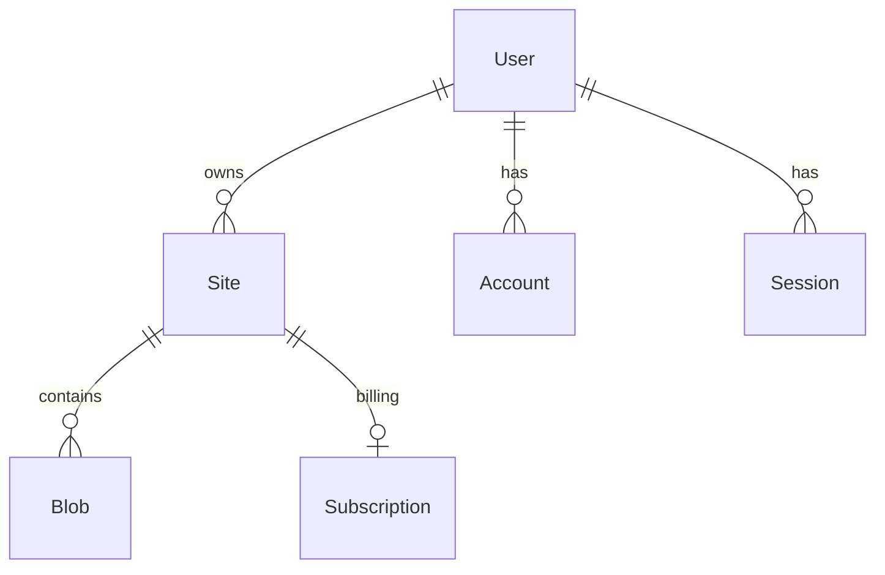

# Architecture Notes

This repo implements Flowershow Cloud, a multitenant Next.js app that turns markdown into an elegant website.

It can pull from GitHub or store directly. It stores metadata in Postgres, and indexes content in Typesense. A separate Cloudflare Worker processes markdown uploads and updates Blob metadata and search indexing.

## High-level data flow

1. User authenticates and creates a site in the Next.js app.
2. Sync is triggered (manual or GitHub webhook) and sent to Inngest from `app/api/webhook/route.ts`.
3. Inngest sync function pulls files from GitHub, writes raw files to R2/MinIO, and creates/updates Blob rows in Postgres.
4. Each markdown upload to storage triggers the Cloudflare worker via queue.
5. Worker parses markdown, updates Blob metadata, and indexes in Typesense.
6. Next.js serves pages by reading metadata from Postgres and raw content from storage (via redirects).

## Domain model (key entities + relationships)

Entities (Prisma models in `prisma/schema.prisma`):
- `User`: account record for an authenticated user.
- `Account`, `Session`, `VerificationToken`: NextAuth-related models.
- `Site`: a published site tied to a GitHub repo/branch and owner.
- `Blob`: a content file record (metadata + status) tied to a `Site`.
- `Subscription`: Stripe billing state for a `Site`.

Relationships:
- `User` 1→N `Site`
- `User` 1→N `Account`
- `User` 1→N `Session`
- `Site` 1→N `Blob`
- `Site` 1→1 `Subscription` (optional)

## Major components

And where they live.

### Auth + signup flow

- NextAuth config and session helpers: `server/auth.ts`.
- OAuth endpoints: `app/api/auth/[...nextauth]/route.ts`.
- Login UI: `app/(dashboard)/cloud/(auth)/login/page.tsx`, `app/(dashboard)/cloud/(auth)/login/login-button.tsx`.
- Site access gate (passworded sites): `app/(public)/site-access/[user]/[project]/page.tsx`.

### User dashboard + site management

- Dashboard layouts and pages: `app/(dashboard)/cloud/(dashboard)/**`.
- Admin pages: `app/(dashboard)/cloud/(dashboard)/admin/page.tsx`.
- Site settings (sync, appearance, billing): `app/(dashboard)/cloud/(dashboard)/site/[id]/settings/**`.
- API backing: `server/api/routers/site.ts`, `server/api/routers/stripe.ts`.

### Rendering system (Markdown/MDX)

- Main page renderer: `app/(public)/site/[user]/[project]/[[...slug]]/page.tsx`.
- MDX client hydration: `components/public/mdx-client.tsx`, `components/public/mdx-client-renderer.tsx`.
- Markdown/MDX processing pipeline: `lib/markdown.ts`, `lib/preprocess-mdx.ts`, `lib/generate-scoped-css.ts`.
- Obsidian/Flowershow remark plugins: `lib/remark-*.ts`.
- MDX component mapping: `components/public/mdx/mdx-components-factory.tsx`.

### Ingest from GitHub (sync + diff)

- GitHub client helpers: `lib/github.ts`.
- Inngest workflows: `inngest/functions.ts`.
- Webhook intake: `app/api/webhook/route.ts`.
- Inngest handler: `app/api/inngest/route.ts`.

### Content pipeline (storage + metadata)

- Content storage abstraction: `lib/content-store.ts`.
- Blob metadata updates and Typesense indexing: Cloudflare worker (`/Users/rgrp/src/datopian/datahub-next-workers`).

### Database structure + business logic

- Schema: `prisma/schema.prisma`.
- Prisma client: `server/db.ts`.
- Core API logic: `server/api/routers/*.ts`.
- Shared DB selectors/helpers: `lib/db/internal.ts`, `lib/actions.ts`.

---

## Next.js (Vercel) responsibilities

- UI and routing via the App Router in `app/` (public site pages, dashboard, admin, settings).
- API routes in `app/api/*`:
  - GitHub webhook -> Inngest event trigger: `app/api/webhook/route.ts`.
  - Inngest handler for sync/delete workflows: `app/api/inngest/route.ts`.
  - Auth (NextAuth GitHub OAuth): `app/api/auth/[...nextauth]/route.ts`.
  - tRPC entrypoint: `app/api/trpc/[trpc]/route.ts`.
  - Stripe webhook: `app/api/stripe/webhook/route.ts`.
  - Site utilities (domain routing, sitemap, robots, raw file redirects): `app/api/domain/...`, `app/api/sitemap/...`, `app/api/robots/...`, `app/api/raw/...`.
- Server-side domain logic:
  - tRPC routers in `server/api/routers/*` (sites, stripe, user, etc).
  - Prisma client in `server/db.ts` with schema in `prisma/`.
  - Sync workflows in `inngest/functions.ts` (triggered by Inngest via the Next.js handler).
- Storage integration:
  - S3/R2/MinIO abstraction in `lib/content-store.ts`.
  - Public raw asset redirect builds R2/MinIO URLs from site+branch: `app/api/raw/[username]/[projectName]/[[...path]]/route.tsx`.

## API surface (web)

HTTP route handlers in `app/api/*`:
- Auth: `/api/auth/[...nextauth]` in `app/api/auth/[...nextauth]/route.ts`.
- GitHub webhooks: `/api/webhook` in `app/api/webhook/route.ts`.
- Inngest entrypoint: `/api/inngest` in `app/api/inngest/route.ts`.
- tRPC endpoint: `/api/trpc/[trpc]` in `app/api/trpc/[trpc]/route.ts`.
- Stripe webhooks: `/api/stripe/webhook` in `app/api/stripe/webhook/route.ts`.
- Domain and routing helpers:
  - `/api/domain/[domain]/verify` in `app/api/domain/[domain]/verify/route.ts`.
  - `/api/domain/[domain]/[[...slug]]` in `app/api/domain/[domain]/[[...slug]]/route.tsx`.
- Site access and lookup:
  - `/api/site/login` in `app/api/site/login/route.ts`.
  - `/api/site/logout` in `app/api/site/logout/route.tsx`.
  - `/api/site/[username]/[projectname]` in `app/api/site/[username]/[projectname]/route.tsx`.
  - `/api/site/bulk-create` in `app/api/site/bulk-create/route.tsx`.
- Content utilities:
  - `/api/raw/[username]/[projectName]/[[...path]]` in `app/api/raw/[username]/[projectName]/[[...path]]/route.tsx`.
  - `/api/sitemap/[user]/[project]` in `app/api/sitemap/[user]/[project]/route.ts`.
  - `/api/robots/[hostname]` in `app/api/robots/[hostname]/route.ts`.
- Migration utility (currently commented out): `/api/migrate` in `app/api/migrate/route.ts`.

tRPC routers (served via `/api/trpc/[trpc]`):
- `site` router in `server/api/routers/site.ts`.
- `stripe` router in `server/api/routers/stripe.ts`.
- `user` router in `server/api/routers/user.ts`.

## Cloudflare Worker (external repo)

Repo: `/Users/rgrp/src/datopian/datahub-next-workers` (not part of this repo).

Purpose: process markdown uploads from R2/MinIO, parse frontmatter and body, update Blob metadata, and index content in Typesense.

Key files:
- Worker entrypoint and queue consumer: `/Users/rgrp/src/datopian/datahub-next-workers/src/worker.js`.
  - Consumes queue messages from R2 events (prod/staging) or MinIO webhook (dev at `/queue`).
  - Fetches markdown from storage, parses metadata, updates `Blob` rows, and indexes into Typesense.
  - Skips non-markdown files, ignores `_flowershow/` path, supports `publish: false` to delete content.
- Markdown parser: `/Users/rgrp/src/datopian/datahub-next-workers/src/parser.js`.
  - Extracts frontmatter + title fallback (H1 or filename).

Queues:
- Dev: `markdown-processing-queue-dev`.
- Staging: `flowershow-markdown-queue-staging`.
- Prod: `flowershow-markdown-queue`.

Storage key pattern handled by the worker:
- `{siteId}/{branch}/raw/{path}`

## Other services

- PostgreSQL (Neon/Vercel): site metadata, users, Blob records.
- R2 (Cloudflare) / MinIO (local): raw markdown and tree blobs.
- Typesense: search indexing for site content (`lib/typesense.ts` and worker).
- Inngest: background sync and delete workflows defined in `inngest/functions.ts`, invoked via `app/api/inngest/route.ts`.
- Stripe: subscription and billing (`server/api/routers/stripe.ts`, `app/api/stripe/webhook/route.ts`).
- GitHub OAuth: auth with NextAuth (`server/auth.ts`, `app/api/auth/[...nextauth]/route.ts`).
